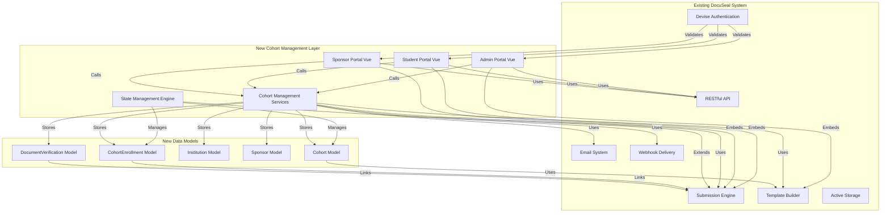

# FloDoc Brownfield Enhancement Architecture
**3-Portal Cohort Management System for Training Institutions**

*Version: v1.0*
*Date: 2025-01-02*
*Status: Draft - Architect Review Complete*

---

## Table of Contents
1. [Introduction](#introduction)
2. [Enhancement Scope and Integration Strategy](#enhancement-scope-and-integration-strategy)
3. [Tech Stack](#tech-stack)
4. [Data Models and Schema Changes](#data-models-and-schema-changes)
5. [Component Architecture](#component-architecture)
6. [API Design and Integration](#api-design-and-integration)
7. [Source Tree](#source-tree)
8. [Infrastructure and Deployment Integration](#infrastructure-and-deployment-integration)
9. [Coding Standards](#coding-standards)
10. [Testing Strategy](#testing-strategy)
11. [Security Integration](#security-integration)
12. [Checklist Results Report](#checklist-results-report)
13. [Next Steps](#next-steps)

---

## Introduction

### Introduction Content

This document outlines the architectural approach for enhancing **DocuSeal** with the **3-Portal Cohort Management System** for training institutions. Its primary goal is to serve as the guiding architectural blueprint for AI-driven development of new features while ensuring seamless integration with the existing system.

**Relationship to Existing Architecture:**
This document supplements existing DocuSeal architecture by defining how new cohort management components will integrate with current systems. Where conflicts arise between new and existing patterns, this document provides guidance on maintaining consistency while implementing enhancements.

### Existing Project Analysis

#### Current Project State

**Primary Purpose:** DocuSeal is an open-source document filling and signing platform providing WYSIWYG PDF form building, multi-signer workflows, and secure digital document signing capabilities.

**Current Tech Stack:**
- **Languages:** Ruby 3.4.2, JavaScript, Vue.js 3, HTML, CSS
- **Frameworks:** Rails 7.x, Shakapacker 8.0, Vue 3.3.2, TailwindCSS 3.4.17, DaisyUI 3.9.4
- **Database:** SQLite (development), PostgreSQL/MySQL (production via DATABASE_URL)
- **Infrastructure:** Docker, Sidekiq for background jobs, Puma web server
- **External Dependencies:** AWS S3, Google Cloud Storage, Azure Cloud (optional), SMTP for emails

**Architecture Style:** Monolithic Rails 7 application with Vue.js 3 frontend, following MVC pattern with service objects for complex business logic.

**Deployment Method:** Docker-based deployment with existing CI/CD pipeline, Shakapacker for asset compilation, Sidekiq workers for background processing.

#### Available Documentation

- ✅ **API Documentation** - Complete RESTful API with examples in Node.js, Ruby, Python, PHP, Java, Go, C#, TypeScript, JavaScript
- ✅ **Webhook Documentation** - Submission, form, and template webhooks with event types and payload schemas
- ✅ **Embedding Documentation** - React, Vue, Angular, JavaScript form builders and signing forms
- ⚠️ **Architecture Documentation** - **Created via this document** (previously missing)
- ⚠️ **Coding Standards** - **To be documented** (previously missing)
- ⚠️ **Source Tree Documentation** - **Created via this document** (previously missing)
- ⚠️ **Technical Debt Documentation** - **To be analyzed** (previously missing)

#### Identified Constraints

- **Multi-tenancy:** Current system supports single-account or multi-tenant mode via `Docuseal.multitenant?` flag
- **Authentication:** Devise-based with 2FA support, JWT tokens for API access
- **Authorization:** Cancancan with role-based access via `AccountAccess` model
- **Storage:** Active Storage with multiple backend support (S3, GCS, Azure, local)
- **PDF Processing:** HexaPDF for generation/signing, PDFium for rendering
- **Background Jobs:** Sidekiq with Redis dependency
- **UI Framework:** Vue 3 with Composition API, DaisyUI components
- **Mobile Support:** Existing responsive design must be maintained

### Change Log

| Change | Date | Version | Description | Author |
|--------|------|---------|-------------|--------|
| Initial Architecture Creation | 2025-01-02 | v1.0 | Brownfield enhancement architecture for 3-portal cohort management | Winston (Architect) |

---

## Enhancement Scope and Integration Strategy

### Enhancement Overview

**Enhancement Type:** ✅ **Major Feature Addition** (3-Portal Cohort Management System)

**Scope:** Transform the single-portal DocuSeal platform into a specialized 3-portal cohort management system for South African private training institutions. The system will manage training cohorts (learnerships, internships, candidacies) through a coordinated workflow involving institution admins, students, and sponsors.

**Integration Impact:** ✅ **Significant Impact** (substantial existing code changes required)

### Integration Approach

**Code Integration Strategy:**
- **Additive Approach:** All new functionality will be added as new models, controllers, and components without modifying existing DocuSeal core logic
- **Extension Pattern:** Extend existing authentication and authorization to support new role types
- **Service Layer:** Create new service objects in `lib/cohorts/` directory for cohort-specific business logic
- **Event-Driven:** Leverage existing webhook infrastructure for cohort workflow notifications

**Database Integration:**
- **New Tables:** Create 5 new tables (`cohorts`, `cohort_enrollments`, `institutions`, `sponsors`, `document_verifications`) with foreign keys to existing tables
- **No Schema Modifications:** Existing tables remain unchanged, only new relationships added
- **Migration Strategy:** Sequential migrations with rollback capability, tested on production-like data
- **Data Integrity:** Use database transactions for cohort state transitions

**API Integration:**
- **Endpoint Extension:** New endpoints under `/api/v1/cohorts/*` following existing RESTful patterns
- **Authentication Reuse:** Leverage existing Devise + JWT authentication without modification
- **Submission Integration:** Use existing submission APIs for document signing workflows
- **Versioning:** No new API version needed, endpoints extend v1

**UI Integration:**
- **Portal Architecture:** Three separate Vue-based portals (Admin, Student, Sponsor) with custom TailwindCSS design
- **Component Reuse:** Embed existing DocuSeal form builder and signing components within new portal frameworks
- **Navigation:** Role-based portal switching via new navigation layer
- **Design System:** Custom TailwindCSS (replacing DaisyUI) for portals while maintaining mobile responsiveness

### Compatibility Requirements

**Existing API Compatibility:** ✅ **MAINTAINED**
- All new endpoints follow existing DocuSeal API patterns
- No breaking changes to existing public APIs
- Existing authentication mechanisms remain unchanged

**Database Schema Compatibility:** ✅ **MAINTAINED**
- New tables only, no modifications to existing tables
- Foreign key relationships to existing tables (users, submissions, templates)
- Backward compatibility through additive schema changes

**UI/UX Consistency:** ✅ **ADAPTED**
- **Challenge:** PRD specifies custom UI/UX (not DaisyUI) for portals
- **Solution:** Maintain mobile-first responsive principles, consistent interaction patterns, but allow custom design system
- **Existing UI:** DocuSeal's existing DaisyUI interface remains unchanged for legacy features

**Performance Impact:** ✅ **ACCEPTABLE**
- **Target:** Not exceed current memory usage by more than 20%
- **Mitigation:** Pagination, lazy loading, background processing for large cohorts
- **Monitoring:** Extend existing metrics to track cohort-specific performance

---

## Tech Stack

### Existing Technology Stack

| Category | Current Technology | Version | Usage in Enhancement | Notes |
|----------|-------------------|---------|---------------------|--------|
| **Backend Language** | Ruby | 3.4.2 | ✅ Core backend logic | Existing version maintained |
| **Web Framework** | Rails | 7.x | ✅ Controllers, Models, Views | Existing patterns followed |
| **Frontend Framework** | Vue.js | 3.3.2 | ✅ All three portals | Composition API for new components |
| **CSS Framework** | TailwindCSS | 3.4.17 | ✅ Custom portal styling | Replacing DaisyUI for portals |
| **UI Components** | DaisyUI | 3.9.4 | ⚠️ Legacy DocuSeal UI only | Not used in new portals |
| **Build Tool** | Shakapacker | 8.0 | ✅ Asset compilation | Existing configuration maintained |
| **Database** | PostgreSQL/MySQL/SQLite | Latest | ✅ New cohort tables | DATABASE_URL configuration |
| **Background Jobs** | Sidekiq | Latest | ✅ Email notifications, reminders | Existing queue system |
| **PDF Processing** | HexaPDF | Latest | ✅ Document generation/signing | Core DocuSeal capability |
| **PDF Rendering** | PDFium | Latest | ✅ Document preview | Existing rendering engine |
| **Authentication** | Devise | Latest | ✅ User auth + 2FA | Extended for new roles |
| **Authorization** | Cancancan | Latest | ✅ Role-based access | Extended for cohort permissions |
| **Storage** | Active Storage | Latest | ✅ Document storage | Existing multi-backend support |
| **Job Queue** | Redis | Latest | ✅ Sidekiq backend | Required dependency |
| **API Auth** | JWT | Latest | ✅ API token authentication | Existing mechanism |
| **Email** | SMTP | Latest | ✅ Notifications | Existing infrastructure |

### New Technology Additions

**No new technologies required.** The enhancement leverages existing DocuSeal technology stack entirely. All new functionality will be implemented using current frameworks and libraries.

**Rationale:** Brownfield enhancement should minimize technology changes to reduce risk and maintain compatibility. The existing stack provides all necessary capabilities for the 3-portal cohort management system.

---

## Data Models and Schema Changes

### New Data Models

#### **Cohort Model**
**Purpose:** Represents a training program cohort (learnership, internship, candidacy) managed by an institution. Contains program metadata, templates, and workflow state.

**Integration:** Links to existing `Account` (institution), `Template` (agreement templates), and manages `CohortEnrollment` records.

**Key Attributes:**
- `name`: string - Cohort identifier (e.g., "Q1 2025 Learnership Program")
- `program_type`: enum [learnership, internship, candidacy] - Fixed program types
- `institution_id`: bigint - Foreign key to new `Institutions` table
- `sponsor_email`: string - Email for sponsor notifications
- `student_count`: integer - Expected number of students
- `main_template_id`: bigint - Foreign key to existing `Template` (main agreement)
- `supporting_templates`: jsonb - Array of supporting document template IDs
- `admin_signed_at`: datetime - When admin signed main agreement
- `state`: enum [draft, active, completed, cancelled] - Workflow state
- `start_date`, `end_date`: datetime - Program timeline

**Relationships:**
- **With Existing:** `Account` (institution), `Template` (agreement templates), `User` (admin creator)
- **With New:** `CohortEnrollment` (has_many), `DocumentVerification` (has_many)

#### **CohortEnrollment Model**
**Purpose:** Represents a student's enrollment in a cohort, tracking their document submission progress and state through the workflow.

**Integration:** Links to existing `User` (student), `Submission` (document signing workflows), and manages verification state.

**Key Attributes:**
- `cohort_id`: bigint - Foreign key to Cohort
- `user_id`: bigint - Foreign key to existing User (student)
- `submission_id`: bigint - Foreign key to existing Submission (main agreement)
- `supporting_submission_ids`: jsonb - Array of submission IDs for supporting documents
- `state`: enum [waiting, in_progress, complete] - Student workflow state
- `document_verification_state`: enum [pending, verified, rejected] - Admin verification state
- `rejection_reason`: text - Reason for document rejection
- `student_data`: jsonb - Student demographics (age, race, city, gender, disability)
- `uploaded_documents`: jsonb - Metadata about uploaded files (matric, ID, etc.)

**Relationships:**
- **With Existing:** `User` (student), `Submission` (main agreement), `Template` (supporting docs)
- **With New:** `Cohort` (belongs_to), `DocumentVerification` (has_many)

#### **Institution Model**
**Purpose:** Represents a private training institution, providing multi-tenancy for the cohort management system.

**Integration:** Extends existing `Account` concept but adds institution-specific metadata and relationships.

**Key Attributes:**
- `account_id`: bigint - Foreign key to existing Account (for backward compatibility)
- `name`: string - Institution name
- `registration_number`: string - Industry registration number
- `address`: text - Physical address
- `contact_email`: string - Primary contact
- `contact_phone`: string - Contact number
- `super_admin_id`: bigint - Foreign key to User (institution super admin)
- `settings`: jsonb - Institution-specific configurations

**Relationships:**
- **With Existing:** `Account` (has_one), `User` (has_many admins)
- **With New:** `Cohort` (has_many), `Sponsor` (has_many)

#### **Sponsor Model**
**Purpose:** Represents program sponsors (companies/organizations) who sign agreements for cohorts.

**Integration:** Independent model for sponsor management, linked to cohorts via email and approval workflow.

**Key Attributes:**
- `company_name`: string - Sponsor organization name
- `contact_email`: string - Primary contact email
- `contact_name`: string - Contact person name
- `contact_phone`: string - Contact number
- `tax_number`: string - Tax/registration number
- `institution_id`: bigint - Foreign key to Institution
- `user_id`: bigint - Foreign key to User (if sponsor creates account)

**Relationships:**
- **With Existing:** `User` (optional account), `Submission` (signing workflows)
- **With New:** `Institution` (belongs_to), `Cohort` (referenced via email)

#### **DocumentVerification Model**
**Purpose:** Audit trail for admin document verification actions (approvals/rejections).

**Integration:** Links to `CohortEnrollment` and existing `User` (admin who performed verification).

**Key Attributes:**
- `cohort_enrollment_id`: bigint - Foreign key to enrollment
- `admin_id`: bigint - Foreign key to User (admin)
- `document_type`: string - Type of document verified
- `action`: enum [approved, rejected] - Verification decision
- `reason`: text - Rejection reason (if rejected)
- `metadata`: jsonb - Additional verification context

**Relationships:**
- **With Existing:** `User` (admin), `Submission` (document reference)
- **With New:** `CohortEnrollment` (belongs_to)

### Schema Integration Strategy

**Database Changes Required:**

**New Tables:**
```sql
cohorts
cohort_enrollments
institutions
sponsors
document_verifications
```

**Modified Tables:** None (100% backward compatible)

**New Indexes:**
- `cohorts.account_id` - Institution lookup
- `cohort_enrollments.cohort_id, user_id` - Enrollment uniqueness
- `cohort_enrollments.state` - Workflow state queries
- `institutions.account_id` - Multi-tenancy isolation
- `document_verifications.cohort_enrollment_id` - Audit trail queries

**Migration Strategy:**
1. **Phase 1:** Create new tables with foreign keys (no data dependencies)
2. **Phase 2:** Add indexes for performance
3. **Phase 3:** Backfill any required default data
4. **Rollback Plan:** Reverse migration order, preserve existing data

**Backward Compatibility:**
- ✅ Existing tables unchanged
- ✅ Existing relationships preserved
- ✅ No breaking schema changes
- ✅ Additive-only modifications

---

## Component Architecture

### New Components

#### **Cohort Management Service Layer**
**Responsibility:** Business logic for cohort lifecycle, state transitions, and workflow orchestration

**Integration Points:**
- Uses existing `Submission` and `Template` services for document workflows
- Integrates with existing `EmailNotification` system for alerts
- Leverages existing `WebhookDelivery` for external integrations

**Key Interfaces:**
- `CohortWorkflowService` - Manages cohort state transitions
- `EnrollmentService` - Handles student enrollment and document submission
- `VerificationService` - Admin document verification workflow
- `SponsorService` - Sponsor signing orchestration

**Dependencies:**
- **Existing Components:** `SubmissionService`, `TemplateService`, `EmailService`, `WebhookService`
- **New Components:** `CohortStateEngine`, `EnrollmentValidator`, `SponsorAccessManager`

**Technology Stack:** Ruby service objects in `lib/cohorts/`, following existing patterns in `lib/submissions/`

#### **Admin Portal Vue Application**
**Responsibility:** Cohort creation, management, verification, and analytics interface

**Integration Points:**
- Embeds existing DocuSeal form builder for template creation
- Uses existing API endpoints for document operations
- Integrates with existing authentication system

**Key Interfaces:**
- `CohortDashboard.vue` - Main admin dashboard
- `CohortWizard.vue` - Multi-step cohort creation
- `VerificationInterface.vue` - Document review/rejection
- `SponsorCoordinator.vue` - Sponsor management
- `AnalyticsView.vue` - Reporting and metrics
- `ExcelExport.vue` - FR23 data export

**Dependencies:**
- **Existing Components:** `TemplateBuilder` (embedded), `SubmissionPreview` (embedded)
- **New Components:** `CohortList`, `EnrollmentTable`, `VerificationModal`

**Technology Stack:** Vue 3 Composition API, Custom TailwindCSS, Axios for API calls

#### **Student Portal Vue Application**
**Responsibility:** Student enrollment, document upload, and agreement completion interface

**Integration Points:**
- Embeds existing DocuSeal signing form components
- Uses existing file upload infrastructure
- Integrates with existing authentication for student access

**Key Interfaces:**
- `CohortWelcome.vue` - Portal entry and authentication
- `DocumentUpload.vue` - File upload interface
- `AgreementForm.vue` - Embedded DocuSeal form builder
- `StatusDashboard.vue` - Progress tracking
- `ResubmissionFlow.vue` - Rejection handling

**Dependencies:**
- **Existing Components:** `SubmissionForm` (embedded), `FileDropzone` (embedded)
- **New Components:** `CohortAccess`, `DocumentChecklist`, `ProgressTracker`

**Technology Stack:** Vue 3 Composition API, Custom TailwindCSS, Existing submission form components

#### **Sponsor Portal Vue Application**
**Responsibility:** Multi-student review, bulk signing, and cohort finalization interface

**Integration Points:**
- Embeds existing DocuSeal signature components
- Uses existing submission APIs for signing workflows
- Integrates with existing authentication for sponsor access

**Key Interfaces:**
- `SponsorDashboard.vue` - Cohort overview and student list
- `StudentReview.vue` - Individual student document review
- `BulkSigning.vue` - Mass signature operations
- `CohortFinalization.vue` - Completion workflow

**Dependencies:**
- **Existing Components:** `SignatureCapture` (embedded), `SubmissionViewer` (embedded)
- **New Components:** `StudentProgressList`, `BulkSignControls`

**Technology Stack:** Vue 3 Composition API, Custom TailwindCSS, Existing signing components

#### **State Management Engine**
**Responsibility:** Orchestrate complex workflow states across all three portals

**Integration Points:**
- Hooks into existing submission state machine
- Manages cohort-level state transitions
- Enforces workflow rules (sponsor access only after student completion)

**Key Interfaces:**
- `CohortStateMachine` - State transition logic
- `WorkflowEnforcer` - Business rule validation
- `EventLogger` - Audit trail generation

**Dependencies:**
- **Existing Components:** `SubmissionState` (extended)
- **New Components:** `CohortStateTransitions`, `EnrollmentValidator`

**Technology Stack:** Ruby state machine pattern, ActiveRecord callbacks

### Component Interaction Diagram



### Component Props and Events Documentation

#### **Admin Portal Components**

**CohortWizard.vue**
```typescript
// Props
interface Props {
  institutionId: number
  availableTemplates: Template[]  // Existing DocuSeal templates
  programTypes: ['learnership', 'internship', 'candidacy']
}

// Events
interface Emits {
  (e: 'created', cohort: Cohort): void
  (e: 'cancelled'): void
  (e: 'error', message: string): void
}

// State
interface State {
  step: 1 | 2 | 3 | 4
  formData: {
    name: string
    programType: string
    sponsorEmail: string
    studentCount: number
    mainTemplateId: number
    supportingTemplateIds: number[]
    startDate: string
    endDate: string
  }
}
```

**VerificationInterface.vue**
```typescript
// Props
interface Props {
  cohortId: number
  enrollments: Enrollment[]
  verificationHistory: Verification[]
}

// Events
interface Emits {
  (e: 'verified', enrollmentId: number, action: 'approved' | 'rejected', reason?: string): void
  (e: 'bulkVerify', enrollmentIds: number[], action: 'approved' | 'rejected'): void
}
```

#### **Student Portal Components**

**DocumentUpload.vue**
```typescript
// Props
interface Props {
  requiredDocuments: string[]  // ['matric', 'id', 'disability', 'qualifications', 'certificates']
  maxFileSize: number  // 10MB
  allowedFormats: string[]  // ['pdf', 'jpg', 'png']
}

// Events
interface Emits {
  (e: 'uploaded', documents: UploadedDocument[]): void
  (e: 'removed', documentId: number): void
  (e: 'error', errors: string[]): void
}

// State
interface State {
  uploadedFiles: File[]
  uploadProgress: Record<number, number>
  validationErrors: string[]
}
```

**AgreementForm.vue**
```typescript
// Props
interface Props {
  templateId: number
  submissionId?: number  // For existing submission
  readOnly?: boolean
}

// Events
interface Emits {
  (e: 'completed', submission: Submission): void
  (e: 'saved', submission: Submission): void
  (e: 'error', error: string): void
}
```

#### **Sponsor Portal Components**

**BulkSigning.vue**
```typescript
// Props
interface Props {
  cohortId: number
  studentCount: number
  completedCount: number
  signatureRequired: boolean
  initialsRequired: boolean
}

// Events
interface Emits {
  (e: 'bulkSigned', signatureData: SignatureData): void
  (e: 'individualSign', studentId: number, signatureData: SignatureData): void
  (e: 'error', error: string): void
}

// State
interface State {
  signatureCanvas: HTMLCanvasElement | null
  initialsCanvas: HTMLCanvasElement | null
  selectedStudents: number[]
  isDrawing: boolean
}
```

#### **Shared Components**

**PortalNavigation.vue**
```typescript
// Props
interface PortalNavigationProps {
  portal: 'admin' | 'student' | 'sponsor'
  user?: {
    name: string
    email: string
    role?: string
  }
  cohortName?: string
}

// Events
interface PortalNavigationEvents {
  (e: 'navigate', view: string): void
  (e: 'logout'): void
  (e: 'switchRole'): void  // For admin users with multiple roles
}
```

**RoleSwitcher.vue**
```typescript
// Props
interface RoleSwitcherProps {
  availableRoles: Array<{
    role: string
    portal: 'admin' | 'student' | 'sponsor'
    label: string
  }>
  currentRole: string
}

// Events
interface RoleSwitcherEvents {
  (e: 'roleChange', newRole: { role: string, portal: string }): void
}
```

**PortalNotifications.vue**
```typescript
// Props
interface PortalNotificationsProps {
  notifications: Array<{
    id: number
    type: 'success' | 'error' | 'warning' | 'info'
    message: string
    timestamp: string
    read: boolean
  }>
  autoDismiss?: boolean
  dismissTime?: number  // milliseconds
}

// Events
interface PortalNotificationsEvents {
  (e: 'dismiss', notificationId: number): void
  (e: 'markRead', notificationId: number): void
}
```

### UI Mockups and Wireframes Reference

#### **Admin Portal Wireframes**

**Dashboard View:**
```
┌─────────────────────────────────────────────────────────────┐
│  FloDoc Cohort Management - Institution Name               │
├─────────────────────────────────────────────────────────────┤
│  [Create Cohort]  [Export Data]  [Settings]  [Logout]      │
├─────────────────────────────────────────────────────────────┤
│  Overview Statistics                                       │
│  ┌─────────────┐ ┌─────────────┐ ┌─────────────┐          │
│  │ Active      │ │ Completed   │ │ Total       │          │
│  │ Cohorts: 5  │ │ Cohorts: 12 │ │ Students: 250│         │
│  └─────────────┘ └─────────────┘ └─────────────┘          │
├─────────────────────────────────────────────────────────────┤
│  Recent Cohorts                                            │
│  ┌──────────────────────────────────────────────────────┐  │
│  │ Q1 2025 Learnership  │ Active │ 32/50 Complete │ [View]│
│  │ Q4 2024 Internship   │ Draft  │ 0/20 Complete  │ [View]│
│  │ Q3 2024 Candidacy    │ Complete │ 45/45 Done   │ [View]│
│  └──────────────────────────────────────────────────────┘  │
└─────────────────────────────────────────────────────────────┘
```

**Cohort Creation Wizard:**
```
Step 1: Basic Information
┌─────────────────────────────────────────────────────────────┐
│ Cohort Name: [Q1 2025 Learnership_______________]          │
│ Program Type: [Learnership ▼]  [Internship] [Candidacy]    │
│ Student Count: [50___]  Sponsor Email: [sponsor@company.com]│
└─────────────────────────────────────────────────────────────┘

Step 2: Templates
┌─────────────────────────────────────────────────────────────┐
│ Main Agreement Template: [Select Template ▼]               │
│ Supporting Templates:                                       │
│ [✓] Code of Conduct  [✓] Privacy Policy  [ ] Other         │
└─────────────────────────────────────────────────────────────┘

Step 3: Timeline
┌─────────────────────────────────────────────────────────────┐
│ Start Date: [2025-02-01]  End Date: [2025-07-31]           │
└─────────────────────────────────────────────────────────────┘

Step 4: Review & Create
┌─────────────────────────────────────────────────────────────┐
│ Summary:                                                    │
│ • 50 students for Learnership program                       │
│ • Main agreement: Learnership Agreement                     │
│ • Supporting docs: Code of Conduct, Privacy Policy          │
│ • Timeline: Feb 1 - Jul 31, 2025                            │
│                                                             │
│ [Create Cohort]  [Back]  [Cancel]                           │
└─────────────────────────────────────────────────────────────┘
```

**Document Verification Interface:**
```
┌─────────────────────────────────────────────────────────────┐
│  Verification Queue - Q1 2025 Learnership                  │
│  [Filter: Pending] [Sort: Date] [Bulk Actions]             │
├─────────────────────────────────────────────────────────────┤
│  Student: John Doe (john@example.com)                      │
│  Documents:                                                │
│  ┌──────────────────────────────────────────────────────┐  │
│  │ Matric Certificate: [Preview] [Approve] [Reject]     │  │
│  │ ID Document:        [Preview] [Approve] [Reject]     │  │
│  │ Disability Doc:     [Preview] [Approve] [Reject]     │  │
│  └──────────────────────────────────────────────────────┘  │
│  Rejection Reason: [____________________________________]   │
│  [Submit Verification]                                     │
└─────────────────────────────────────────────────────────────┘
```

#### **Student Portal Wireframes**

**Welcome Screen:**
```
┌─────────────────────────────────────────────────────────────┐
│  Welcome to Q1 2025 Learnership Program                    │
│  Institution: ABC Training Academy                         │
├─────────────────────────────────────────────────────────────┤
│  Your Enrollment Process:                                  │
│  1. Upload Required Documents                              │
│  2. Sign Program Agreement                                 │
│  3. Sign Supporting Documents                              │
│  4. Wait for Admin Verification                            │
│  5. Sponsor Review & Signing                               │
├─────────────────────────────────────────────────────────────┤
│  Required Documents:                                       │
│  • Matric Certificate                                     │
│  • ID Document                                            │
│  • Disability Documentation (if applicable)               │
│  • Tertiary Qualifications                                │
│  • International Certificates (if applicable)             │
│                                                             │
│  [Start Enrollment]                                        │
└─────────────────────────────────────────────────────────────┘
```

**Document Upload:**
```
┌─────────────────────────────────────────────────────────────┐
│  Upload Required Documents                                 │
├─────────────────────────────────────────────────────────────┤
│  Matric Certificate:  [Drag files here or click to browse] │
│                     [Uploaded: matric.pdf ✓]               │
│  ID Document:         [Drag files here or click to browse] │
│                     [Uploaded: id.pdf ✓]                   │
│  Disability Doc:      [Drag files here or click to browse] │
│                     [No file selected]                     │
│  Qualifications:      [Drag files here or click to browse] │
│                     [Uploaded: degree.pdf ✓]               │
│  Certificates:        [Drag files here or click to browse] │
│                     [Uploaded: cert.pdf ✓]                 │
│                                                             │
│  [Continue to Agreement]  [Save Progress]                  │
└─────────────────────────────────────────────────────────────┘
```

**Status Dashboard:**
```
┌─────────────────────────────────────────────────────────────┐
│  Your Enrollment Status: Complete ✓                        │
│  Last Updated: 2025-01-02 14:30                            │
├─────────────────────────────────────────────────────────────┤
│  Progress: ████████████████████░░░░░░░░  75%               │
│                                                             │
│  Documents:                                                │
│  ✓ Matric Certificate - Uploaded & Signed                  │
│  ✓ ID Document - Uploaded & Signed                         │
│  ✓ Disability Doc - Uploaded & Verified                    │
│  ✓ Qualifications - Uploaded & Signed                      │
│  ✓ Certificates - Uploaded & Signed                        │
│                                                             │
│  Next Step: Waiting for Sponsor Review                     │
│  Estimated Time: 2-3 business days                         │
└─────────────────────────────────────────────────────────────┘
```

#### **Sponsor Portal Wireframes**

**Cohort Overview:**
```
┌─────────────────────────────────────────────────────────────┐
│  Sponsor Portal - Q1 2025 Learnership                      │
│  Institution: ABC Training Academy                         │
├─────────────────────────────────────────────────────────────┤
│  Cohort Summary:                                           │
│  • Total Students: 50                                      │
│  • Ready for Signing: 50                                   │
│  • Already Signed: 0                                       │
│  • Status: All Complete ✓                                  │
├─────────────────────────────────────────────────────────────┤
│  Student List                                              │
│  ┌──────────────────────────────────────────────────────┐  │
│  │ John Doe     │ john@example.com │ Ready │ [Review]   │  │
│  │ Jane Smith   │ jane@example.com │ Ready │ [Review]   │  │
│  │ ... (48 more)│                   │       │            │  │
│  └──────────────────────────────────────────────────────┘  │
│                                                             │
│  [Bulk Sign All]  [Sign Selected]  [Export Summary]        │
└─────────────────────────────────────────────────────────────┘
```

**Individual Student Review:**
```
┌─────────────────────────────────────────────────────────────┐
│  John Doe - Document Review                                │
│  [← Back to Overview]                                      │
├─────────────────────────────────────────────────────────────┤
│  Student Information:                                      │
│  Age: 23 | Race: Black | City: Johannesburg | Gender: Male │
│  Disability: None                                          │
├─────────────────────────────────────────────────────────────┤
│  Documents for Review:                                     │
│  ┌──────────────────────────────────────────────────────┐  │
│  │ Main Agreement: [View PDF] [Sign]                   │  │
│  │ Code of Conduct: [View PDF] [Sign]                  │  │
│  │ Privacy Policy: [View PDF] [Sign]                   │  │
│  └──────────────────────────────────────────────────────┘  │
│                                                             │
│  Your Signature: [Canvas Area - Draw Here]                │
│  Your Initials:  [Canvas Area - Draw Here]                │
│                                                             │
│  [Sign This Student]  [Skip for Now]                      │
└─────────────────────────────────────────────────────────────┘
```

**Bulk Signing Interface:**
```
┌─────────────────────────────────────────────────────────────┐
│  Bulk Signing - Q1 2025 Learnership                        │
│  50 students ready for signing                             │
├─────────────────────────────────────────────────────────────┤
│  Signature Application:                                    │
│  Apply to: [All 50 Students ▼]  [Selected Students]        │
│                                                             │
│  Your Signature:                                           │
│  ┌──────────────────────────────────────────────────────┐  │
│  │ [Canvas Area - Draw Your Signature]                 │  │
│  │ [Clear]  [Apply to All]                             │  │
│  └──────────────────────────────────────────────────────┘  │
│                                                             │
│  Your Initials:                                            │
│  ┌──────────────────────────────────────────────────────┐  │
│  │ [Canvas Area - Draw Your Initials]                  │  │
│  │ [Clear]  [Apply to All]                             │  │
│  └──────────────────────────────────────────────────────┘  │
│                                                             │
│  [Sign All Documents]  [Cancel]                           │
└─────────────────────────────────────────────────────────────┘
```

---

## API Design and Integration

### API Integration Strategy

**API Integration Strategy:** Extend existing DocuSeal API v1 with new cohort-specific endpoints under `/api/v1/cohorts/*`. All endpoints follow existing RESTful patterns, authentication mechanisms, and response formats.

**Authentication:** Reuse existing Devise + JWT authentication. No changes to auth flow required. New endpoints will require the same bearer token authentication as existing endpoints.

**Versioning:** No new API version required. New endpoints extend v1 following existing patterns. All new endpoints return consistent JSON response formats matching existing endpoints.

### New API Endpoints

#### **Cohort Management Endpoints**

##### **Create Cohort**
- **Method:** `POST`
- **Endpoint:** `/api/v1/cohorts`
- **Purpose:** Create new cohort with templates and configuration
- **Integration:** Uses existing Template APIs for template management

**Request:**
```json
{
  "cohort": {
    "name": "Q1 2025 Learnership",
    "program_type": "learnership",
    "sponsor_email": "sponsor@company.com",
    "student_count": 50,
    "main_template_id": 123,
    "supporting_template_ids": [124, 125],
    "start_date": "2025-02-01",
    "end_date": "2025-07-31"
  }
}
```

**Response:**
```json
{
  "id": 1,
  "name": "Q1 2025 Learnership",
  "state": "draft",
  "created_at": "2025-01-02T10:00:00Z",
  "links": {
    "self": "/api/v1/cohorts/1",
    "enrollments": "/api/v1/cohorts/1/enrollments"
  }
}
```

##### **List Cohorts**
- **Method:** `GET`
- **Endpoint:** `/api/v1/cohorts`
- **Purpose:** Get paginated list of cohorts for current institution
- **Integration:** Filters by current user's institution

**Response:**
```json
{
  "data": [
    {
      "id": 1,
      "name": "Q1 2025 Learnership",
      "program_type": "learnership",
      "state": "active",
      "completion_percentage": 65,
      "student_count": 50,
      "completed_students": 32
    }
  ],
  "meta": {
    "page": 1,
    "per_page": 20,
    "total": 1
  }
}
```

##### **Get Cohort Details**
- **Method:** `GET`
- **Endpoint:** `/api/v1/cohorts/:id`
- **Purpose:** Get detailed cohort information with enrollment status
- **Integration:** Aggregates data from existing Submission APIs

**Response:**
```json
{
  "id": 1,
  "name": "Q1 2025 Learnership",
  "program_type": "learnership",
  "state": "active",
  "sponsor_email": "sponsor@company.com",
  "admin_signed_at": "2025-01-02T10:30:00Z",
  "templates": {
    "main": { "id": 123, "name": "Learnership Agreement" },
    "supporting": [{ "id": 124, "name": "Code of Conduct" }]
  },
  "enrollments": {
    "waiting": 5,
    "in_progress": 13,
    "complete": 32
  }
}
```

##### **Invite Students**
- **Method:** `POST`
- **Endpoint:** `/api/v1/cohorts/:id/invitations`
- **Purpose:** Generate invite links or send email invitations
- **Integration:** Uses existing email system and user creation

**Request:**
```json
{
  "students": [
    { "email": "student1@example.com", "first_name": "John", "last_name": "Doe" },
    { "email": "student2@example.com", "first_name": "Jane", "last_name": "Smith" }
  ],
  "send_email": true
}
```

**Response:**
```json
{
  "invitations_sent": 2,
  "invite_links": [
    { "email": "student1@example.com", "link": "https://flo.doc/invite/abc123" },
    { "email": "student2@example.com", "link": "https://flo.doc/invite/def456" }
  ]
}
```

##### **Export Cohort Data (FR23)**
- **Method:** `GET`
- **Endpoint:** `/api/v1/cohorts/:id/export`
- **Purpose:** Export cohort data to Excel format
- **Integration:** Uses existing rubyXL gem for Excel generation

**Query Parameters:**
- `format=xlsx`
- `include=student_demographics,program_details,sponsor_info`

**Response:** Excel file download with columns: cohort_name, student_name, student_surname, student_age, student_race, student_city, program_type, sponsor_company_name, disability_status, gender

### Web Portal Routes

#### **Admin Portal Routes**

| Route | Method | Purpose | Authentication | Component |
|-------|--------|---------|----------------|-----------|
| `/cohorts/admin` | GET | Cohort dashboard | Devise + Role | `AdminPortal.vue` |
| `/cohorts/admin/new` | GET | Create cohort wizard | Devise + Role | `CohortWizard.vue` |
| `/cohorts/admin/:id` | GET | Cohort details | Devise + Role | `CohortDashboard.vue` |
| `/cohorts/admin/:id/verify` | GET | Document verification | Devise + Role | `VerificationInterface.vue` |
| `/cohorts/admin/:id/sponsors` | GET | Sponsor management | Devise + Role | `SponsorCoordinator.vue` |
| `/cohorts/admin/:id/analytics` | GET | Analytics view | Devise + Role | `AnalyticsView.vue` |
| `/cohorts/admin/:id/export` | GET | Excel export (FR23) | Devise + Role | `ExcelExport.vue` |
| `/cohorts/admin/:id/invite` | POST | Student invitations | Devise + Role | API call |

#### **Student Portal Routes**

| Route | Method | Purpose | Authentication | Component |
|-------|--------|---------|----------------|-----------|
| `/cohorts/student/:token` | GET | Portal entry (token) | Token-based | `StudentPortal.vue` |
| `/cohorts/student/:token/welcome` | GET | Welcome screen | Token-based | `CohortWelcome.vue` |
| `/cohorts/student/:token/upload` | GET | Document upload | Token-based | `DocumentUpload.vue` |
| `/cohorts/student/:token/agreement` | GET | Main agreement | Token-based | `AgreementForm.vue` |
| `/cohorts/student/:token/supporting` | GET | Supporting docs | Token-based | `AgreementForm.vue` |
| `/cohorts/student/:token/status` | GET | Progress dashboard | Token-based | `StatusDashboard.vue` |
| `/cohorts/student/:token/resubmit` | GET | Re-submission flow | Token-based | `ResubmissionFlow.vue` |

#### **Sponsor Portal Routes**

| Route | Method | Purpose | Authentication | Component |
|-------|--------|---------|----------------|-----------|
| `/cohorts/sponsor/:token` | GET | Sponsor dashboard | Token-based | `SponsorPortal.vue` |
| `/cohorts/sponsor/:token/overview` | GET | Cohort overview | Token-based | `SponsorDashboard.vue` |
| `/cohorts/sponsor/:token/student/:student_id` | GET | Student review | Token-based | `StudentReview.vue` |
| `/cohorts/sponsor/:token/bulk-sign` | POST | Bulk signing | Token-based | `BulkSigning.vue` |
| `/cohorts/sponsor/:token/finalize` | POST | Cohort finalization | Token-based | `CohortFinalization.vue` |

#### **Enrollment Management Endpoints**

##### **List Enrollments**
- **Method:** `GET`
- **Endpoint:** `/api/v1/cohorts/:id/enrollments`
- **Purpose:** Get all student enrollments with status
- **Integration:** Aggregates from CohortEnrollment + existing User/Submission data

**Response:**
```json
{
  "data": [
    {
      "id": 1,
      "student": { "name": "John Doe", "email": "john@example.com" },
      "state": "complete",
      "verification_state": "verified",
      "documents": { "uploaded": 5, "signed": 3 },
      "created_at": "2025-01-01T10:00:00Z"
    }
  ]
}
```

##### **Verify Document**
- **Method:** `POST`
- **Endpoint:** `/api/v1/enrollments/:id/verify`
- **Purpose:** Admin document verification (approve/reject)
- **Integration:** Creates DocumentVerification records

**Request:**
```json
{
  "action": "reject",
  "document_type": "matric_certificate",
  "reason": "Certificate is not certified by SAQA"
}
```

#### **Sponsor Endpoints**

##### **Get Sponsor Cohort Overview**
- **Method:** `GET`
- **Endpoint:** `/api/v1/sponsors/cohorts/:token`
- **Purpose:** Sponsor access to cohort overview (token-based auth)
- **Integration:** Validates token, checks all students complete

**Response:**
```json
{
  "cohort": { "name": "Q1 2025 Learnership", "student_count": 50 },
  "students": [
    { "id": 1, "name": "John Doe", "state": "complete", "signed": true }
  ],
  "can_sign": true,
  "bulk_sign_available": true
}
```

##### **Bulk Sign**

**Request:**
```json
{
  "signature": "data:image/png;base64,iVBORw0KGgoAAAANSUhEUg...",
  "initials": "data:image/png;base64,iVBORw0KGgoAAAANSUhEUg...",
  "sign_all": true,
  "timestamp": "2025-01-02T15:30:00Z"
}
```

**Success Response (200):**
```json
{
  "signed_count": 50,
  "failed_count": 0,
  "signatures_applied": [
    {
      "enrollment_id": 1,
      "submission_id": 100,
      "status": "signed",
      "signed_at": "2025-01-02T15:30:00Z"
    }
  ],
  "cohort_finalized": true,
  "next_step": "Admin can now finalize cohort and download documents"
}
```

**Error Responses:**
```json
// 422 Validation Error
{
  "error": {
    "code": "VALIDATION_ERROR",
    "message": "Signature data is invalid or corrupted",
    "timestamp": "2025-01-02T15:30:00Z"
  }
}

// 403 Forbidden
{
  "error": {
    "code": "STATE_ERROR",
    "message": "Cannot sign - some students are not ready",
    "details": {
      "ready": 32,
      "total": 50,
      "pending": 18
    }
  }
}
```

### Complete API Response Schemas

#### **Cohort Endpoints**

**POST /api/v1/cohorts - Request:**
```json
{
  "cohort": {
    "name": "Q1 2025 Learnership",
    "program_type": "learnership",
    "sponsor_email": "sponsor@company.com",
    "student_count": 50,
    "main_template_id": 123,
    "supporting_template_ids": [124, 125],
    "start_date": "2025-02-01",
    "end_date": "2025-07-31"
  }
}
```

**POST /api/v1/cohorts - Success Response (201):**
```json
{
  "id": 1,
  "uuid": "550e8400-e29b-41d4-a716-446655440000",
  "name": "Q1 2025 Learnership",
  "program_type": "learnership",
  "state": "draft",
  "sponsor_email": "sponsor@company.com",
  "student_count": 50,
  "main_template_id": 123,
  "supporting_template_ids": [124, 125],
  "start_date": "2025-02-01",
  "end_date": "2025-07-31",
  "admin_signed_at": null,
  "created_at": "2025-01-02T10:00:00Z",
  "updated_at": "2025-01-02T10:00:00Z",
  "links": {
    "self": "/api/v1/cohorts/1",
    "enrollments": "/api/v1/cohorts/1/enrollments",
    "invitations": "/api/v1/cohorts/1/invitations"
  }
}
```

**POST /api/v1/cohorts - Error Responses:**
```json
// 422 Validation Error
{
  "errors": {
    "name": ["can't be blank"],
    "sponsor_email": ["is invalid"],
    "main_template_id": ["must exist"]
  }
}

// 403 Forbidden (wrong institution)
{
  "error": {
    "code": "AUTHORIZATION_ERROR",
    "message": "Access denied"
  }
}
```

**GET /api/v1/cohorts/:id - Success Response (200):**
```json
{
  "id": 1,
  "uuid": "550e8400-e29b-41d4-a716-446655440000",
  "name": "Q1 2025 Learnership",
  "program_type": "learnership",
  "state": "active",
  "sponsor_email": "sponsor@company.com",
  "student_count": 50,
  "admin_signed_at": "2025-01-02T10:30:00Z",
  "created_at": "2025-01-02T10:00:00Z",
  "updated_at": "2025-01-02T10:30:00Z",
  "templates": {
    "main": {
      "id": 123,
      "name": "Learnership Agreement",
      "uuid": "abc123..."
    },
    "supporting": [
      {
        "id": 124,
        "name": "Code of Conduct",
        "uuid": "def456..."
      }
    ]
  },
  "enrollment_summary": {
    "total": 50,
    "waiting": 5,
    "in_progress": 13,
    "complete": 32,
    "rejected": 0
  },
  "completion_percentage": 64,
  "links": {
    "self": "/api/v1/cohorts/1",
    "enrollments": "/api/v1/cohorts/1/enrollments",
    "export": "/api/v1/cohorts/1/export"
  }
}
```

**GET /api/v1/cohorts/:id/enrollments - Success Response (200):**
```json
{
  "data": [
    {
      "id": 1,
      "uuid": "550e8400-e29b-41d4-a716-446655440001",
      "student": {
        "id": 100,
        "name": "John Doe",
        "email": "john@example.com",
        "phone": "+27123456789"
      },
      "state": "complete",
      "verification_state": "verified",
      "rejection_reason": null,
      "student_data": {
        "age": 23,
        "race": "Black",
        "city": "Johannesburg",
        "gender": "Male",
        "disability": "None"
      },
      "documents": {
        "uploaded": 5,
        "signed": 3,
        "rejected": 0
      },
      "created_at": "2025-01-01T10:00:00Z",
      "updated_at": "2025-01-02T14:30:00Z",
      "links": {
        "self": "/api/v1/enrollments/1",
        "verify": "/api/v1/enrollments/1/verify"
      }
    }
  ],
  "meta": {
    "page": 1,
    "per_page": 20,
    "total": 50,
    "filters": {
      "state": ["complete"],
      "verification_state": ["verified"]
    }
  }
}
```

**POST /api/v1/cohorts/:id/invitations - Request:**
```json
{
  "students": [
    {
      "email": "student1@example.com",
      "first_name": "John",
      "last_name": "Doe",
      "phone": "+27123456789",
      "age": 23,
      "race": "Black",
      "city": "Johannesburg",
      "gender": "Male",
      "disability": "None"
    }
  ],
  "send_email": true,
  "message": "Welcome to our Q1 2025 Learnership program!"
}
```

**POST /api/v1/cohorts/:id/invitations - Success Response (201):**
```json
{
  "invitations_sent": 1,
  "invite_links": [
    {
      "email": "student1@example.com",
      "token": "abc123def456",
      "link": "https://flo.doc/cohorts/student/abc123def456",
      "expires_at": "2025-02-01T10:00:00Z"
    }
  ],
  "errors": []
}
```

**GET /api/v1/cohorts/:id/export - Query Parameters:**
- `format=xlsx` (required)
- `include=student_demographics,program_details,sponsor_info` (optional)

**GET /api/v1/cohorts/:id/export - Response:**
- Returns Excel file (.xlsx) as binary download
- **Headers:**
  ```
  Content-Type: application/vnd.openxmlformats-officedocument.spreadsheetml.sheet
  Content-Disposition: attachment; filename="cohort_1_export_20250102.xlsx"
  ```

**Excel Columns:**
```
cohort_name | student_name | student_surname | student_age | student_race | student_city | program_type | sponsor_company_name | disability_status | gender
```

#### **Enrollment Endpoints**

**POST /api/v1/enrollments/:id/verify - Request:**
```json
{
  "action": "reject",
  "document_type": "matric_certificate",
  "reason": "Certificate is not certified by SAQA. Please provide SAQA verification letter.",
  "metadata": {
    "reviewed_by": "admin@institution.com",
    "review_notes": "Checked against SAQA database"
  }
}
```

**POST /api/v1/enrollments/:id/verify - Success Response (200):**
```json
{
  "id": 1,
  "enrollment_id": 1,
  "action": "rejected",
  "document_type": "matric_certificate",
  "reason": "Certificate is not certified by SAQA. Please provide SAQA verification letter.",
  "admin_id": 50,
  "created_at": "2025-01-02T15:00:00Z",
  "metadata": {
    "reviewed_by": "admin@institution.com",
    "review_notes": "Checked against SAQA database"
  }
}
```

**POST /api/v1/enrollments/:id/verify - Error Responses:**
```json
// 422 Invalid State Transition
{
  "error": {
    "code": "STATE_ERROR",
    "message": "Cannot reject enrollment that is already complete"
  }
}

// 404 Not Found
{
  "error": {
    "code": "NOT_FOUND",
    "message": "Enrollment not found"
  }
}
```

#### **Sponsor Endpoints**

**GET /api/v1/sponsors/cohorts/:token - Success Response (200):**
```json
{
  "cohort": {
    "id": 1,
    "name": "Q1 2025 Learnership",
    "program_type": "learnership",
    "student_count": 50,
    "sponsor_email": "sponsor@company.com"
  },
  "students": [
    {
      "id": 1,
      "name": "John Doe",
      "email": "john@example.com",
      "state": "complete",
      "verification_state": "verified",
      "signed": true,
      "signed_at": "2025-01-02T10:00:00Z",
      "documents": {
        "main_agreement": {
          "id": 100,
          "status": "signed",
          "preview_url": "/api/v1/submissions/100/preview"
        },
        "supporting_docs": [
          {
            "id": 101,
            "name": "Code of Conduct",
            "status": "signed"
          }
        ]
      }
    }
  ],
  "summary": {
    "total": 50,
    "completed": 32,
    "pending": 18,
    "signed": 32
  },
  "can_sign": true,
  "bulk_sign_available": true,
  "token_expires_at": "2025-01-16T23:59:59Z"
}
```

**GET /api/v1/sponsors/cohorts/:token - Error Responses:**
```json
// 403 Forbidden (students not complete)
{
  "error": {
    "code": "STATE_ERROR",
    "message": "All students must complete their submissions before sponsor access",
    "details": {
      "completed": 32,
      "total": 50,
      "remaining": 18
    }
  }
}

// 401 Unauthorized (invalid/expired token)
{
  "error": {
    "code": "AUTHENTICATION_ERROR",
    "message": "Invalid or expired sponsor token"
  }
}
```

##### **Bulk Sign**
- **Method:** `POST`
- **Endpoint:** `/api/v1/sponsors/cohorts/:token/bulk-sign`
- **Purpose:** Sign all student agreements at once
- **Integration:** Uses existing submission signing APIs

**Request:**
```json
{
  "signature": "data:image/png;base64,...",
  "initials": "data:image/png;base64,..."
}
```

---

## Source Tree

### Existing Project Structure

```
floDoc-v3/
├── app/
│   ├── controllers/
│   │   ├── api/                          # RESTful API controllers
│   │   │   ├── api_base_controller.rb
│   │   │   ├── submissions_controller.rb
│   │   │   ├── templates_controller.rb
│   │   │   └── [15+ existing controllers]
│   │   ├── [30+ existing controllers]    # Dashboard, settings, etc.
│   ├── models/
│   │   ├── account.rb                    # Multi-tenancy root
│   │   ├── user.rb                       # Devise auth + 2FA
│   │   ├── template.rb                   # Document templates
│   │   ├── submission.rb                 # Document workflows
│   │   ├── submitter.rb                  # Signers/participants
│   │   ├── account_access.rb             # User permissions
│   │   └── [15+ supporting models]
│   ├── jobs/
│   │   ├── process_submitter_completion_job.rb
│   │   ├── send_submission_completed_webhook_request_job.rb
│   │   └── [15+ existing jobs]
│   ├── mailers/
│   │   ├── application_mailer.rb
│   │   ├── submitter_mailer.rb
│   │   └── user_mailer.rb
│   ├── javascript/
│   │   ├── application.js                # Vue 3 entry point
│   │   ├── template_builder/             # PDF form builder (15+ Vue components)
│   │   ├── submission_form/              # Signing interface (10+ Vue components)
│   │   └── elements/                     # Web Components (40+ custom elements)
│   └── views/
│       ├── mailers/                      # Email templates
│       └── shared/                       # Common partials
├── lib/
│   ├── submissions/                      # Core business logic
│   │   ├── generate_result_attachments.rb
│   │   ├── generate_combined_attachment.rb
│   │   └── [10+ submission modules]
│   ├── submitters/                       # Submitter logic
│   ├── templates/                        # Template processing
│   ├── pdf_utils.rb                      # HexaPDF wrapper
│   ├── docuseal.rb                       # Global config
│   ├── ability.rb                        # CanCanCan rules
│   └── send_webhook_request.rb           # Webhook delivery
├── config/
│   ├── routes.rb                         # All routes (200+ lines)
│   ├── database.yml                      # DB config
│   ├── storage.yml                       # Active Storage config
│   ├── sidekiq.yml                       # Background job config
│   └── shakapacker.yml                   # Webpack config
├── db/
│   ├── migrate/                          # Existing migrations
│   └── schema.rb                         # Current schema
└── docs/
    ├── prd.md                            # Product requirements
    └── architecture.md                   # This document
```

### New File Organization

```
floDoc-v3/
├── app/
│   ├── controllers/
│   │   ├── api/
│   │   │   ├── v1/
│   │   │   │   ├── cohorts_controller.rb          # NEW: Cohort API endpoints
│   │   │   │   ├── enrollments_controller.rb      # NEW: Enrollment API endpoints
│   │   │   │   └── sponsors_controller.rb         # NEW: Sponsor API endpoints
│   │   ├── cohorts/                               # NEW: Web controllers
│   │   │   ├── admin_controller.rb                # Admin portal web endpoints
│   │   │   ├── student_controller.rb              # Student portal web endpoints
│   │   │   └── sponsor_controller.rb              # Sponsor portal web endpoints
│   ├── models/
│   │   ├── cohort.rb                              # NEW: Cohort model
│   │   ├── cohort_enrollment.rb                   # NEW: Enrollment model
│   │   ├── institution.rb                         # NEW: Institution model
│   │   ├── sponsor.rb                             # NEW: Sponsor model
│   │   └── document_verification.rb               # NEW: Verification model
│   ├── jobs/
│   │   ├── cohort_reminder_job.rb                 # NEW: Cohort reminders
│   │   ├── cohort_completion_job.rb               # NEW: Workflow completion
│   │   └── excel_export_job.rb                    # NEW: FR23 Excel export
│   ├── mailers/
│   │   ├── cohort_mailer.rb                       # NEW: Cohort notifications
│   │   └── sponsor_mailer.rb                      # NEW: Sponsor notifications
│   ├── javascript/
│   │   ├── cohorts/                               # NEW: Cohort management
│   │   │   ├── admin/                             # Admin portal Vue app
│   │   │   │   ├── AdminPortal.vue
│   │   │   │   ├── CohortDashboard.vue
│   │   │   │   ├── CohortWizard.vue
│   │   │   │   ├── VerificationInterface.vue
│   │   │   │   ├── SponsorCoordinator.vue
│   │   │   │   ├── AnalyticsView.vue
│   │   │   │   └── ExcelExport.vue
│   │   │   ├── student/                           # Student portal Vue app
│   │   │   │   ├── StudentPortal.vue
│   │   │   │   ├── CohortWelcome.vue
│   │   │   │   ├── DocumentUpload.vue
│   │   │   │   ├── AgreementForm.vue
│   │   │   │   ├── StatusDashboard.vue
│   │   │   │   └── ResubmissionFlow.vue
│   │   │   └── sponsor/                           # Sponsor portal Vue app
│   │   │       ├── SponsorPortal.vue
│   │   │       ├── SponsorDashboard.vue
│   │   │       ├── StudentReview.vue
│   │   │       ├── BulkSigning.vue
│   │   │       └── CohortFinalization.vue
│   │   └── shared/                                # NEW: Shared portal components
│   │       ├── PortalNavigation.vue
│   │       ├── RoleSwitcher.vue
│   │       └── PortalNotifications.vue
│   └── views/
│       ├── cohorts/
│       │   ├── admin/
│       │   │   ├── index.html.erb
│       │   │   └── show.html.erb
│       │   ├── student/
│       │   │   ├── index.html.erb
│       │   │   └── show.html.erb
│       │   └── sponsor/
│       │       ├── index.html.erb
│       │       └── show.html.erb
│       └── mailers/
│           ├── cohort_mailer/
│           │   ├── cohort_created.html.erb
│           │   ├── student_invite.html.erb
│           │   └── sponsor_access.html.erb
│           └── sponsor_mailer/
│               └── cohort_ready.html.erb
├── lib/
│   ├── cohorts/                               # NEW: Cohort business logic
│   │   ├── cohort_workflow_service.rb
│   │   ├── enrollment_service.rb
│   │   ├── verification_service.rb
│   │   ├── sponsor_service.rb
│   │   ├── cohort_state_engine.rb
│   │   ├── enrollment_validator.rb
│   │   ├── sponsor_access_manager.rb
│   │   └── excel_export_service.rb
│   └── templates/
│       └── cohort_template_processor.rb       # NEW: Cohort template extensions
├── db/
│   ├── migrate/
│   │   ├── 20250102000001_create_institutions.rb
│   │   ├── 20250102000002_create_cohorts.rb
│   │   ├── 20250102000003_create_cohort_enrollments.rb
│   │   ├── 20250102000004_create_sponsors.rb
│   │   └── 20250102000005_create_document_verifications.rb
│   └── schema.rb                             # UPDATED: New tables added
├── config/
│   └── routes.rb                             # UPDATED: New cohort routes
└── docs/
    ├── architecture.md                       # This document
    └── cohort-workflows.md                   # NEW: Workflow documentation
```

### Integration Guidelines

**File Naming:**
- **Models:** `cohort.rb`, `cohort_enrollment.rb` (snake_case, singular)
- **Controllers:** `cohorts_controller.rb`, `admin_controller.rb` (plural for resources)
- **Vue Components:** `CohortDashboard.vue`, `StudentPortal.vue` (PascalCase)
- **Services:** `cohort_workflow_service.rb` (snake_case, descriptive)
- **Jobs:** `cohort_reminder_job.rb` (snake_case, _job suffix)

**Folder Organization:**
- **API Controllers:** `app/controllers/api/v1/cohorts/` (versioned, resource-based)
- **Web Controllers:** `app/controllers/cohorts/` (portal-specific)
- **Vue Apps:** `app/javascript/cohorts/{admin,student,sponsor}/` (portal separation)
- **Services:** `lib/cohorts/` (business logic separation)

**Import/Export Patterns:**
- **Ruby:** Follow existing patterns (service objects, concerns, modules)
- **Vue:** Use ES6 imports, Composition API, existing API client patterns
- **API:** Consistent JSON response format matching existing endpoints

---

## Infrastructure and Deployment Integration

### Existing Infrastructure

**Current Deployment:** Docker-based with Dockerfile and docker-compose.yml
**Infrastructure Tools:** Docker, Sidekiq, Puma, Redis, PostgreSQL/MySQL
**Environments:** Development (SQLite), Production (PostgreSQL/MySQL)

### Enhancement Deployment Strategy

**Deployment Approach:** Incremental feature addition to existing DocuSeal deployment
- **Zero downtime:** Database migrations are additive only
- **Feature flags:** Can disable cohort features if issues arise
- **Rolling deployment:** Deploy new code alongside existing functionality

**Infrastructure Changes:** None required
- ✅ No new services needed
- ✅ No infrastructure configuration changes
- ✅ Existing Docker setup sufficient
- ✅ Redis already configured for Sidekiq

**Pipeline Integration:**
- ✅ Existing CI/CD handles new Ruby code
- ✅ Shakapacker bundles new Vue components automatically
- ✅ Existing test suite extends with new tests
- ✅ No changes to build process

### Rollback Strategy

**Rollback Method:** Standard git revert + database migration rollback
- **Code rollback:** `git revert <commit-hash>` - Reverts to previous state
- **Database rollback:** `bin/rails db:rollback STEP=5` - Rolls back last 5 migrations
- **Asset rollback:** Previous assets remain cached in CDN

**Risk Mitigation:**
1. **Database backups:** Before migrations run in production
2. **Feature flags:** Can disable cohort routes if needed
3. **Gradual rollout:** Deploy to staging first, then production
4. **Monitoring:** Watch error rates and performance metrics

**Monitoring:**
- Extend existing Rails logging with cohort events
- Add cohort-specific metrics to existing monitoring
- Use existing Sidekiq monitoring for new jobs
- Track API response times for new endpoints

### Resource Sizing Recommendations

**Development Environment:**
- **CPU:** 2 cores minimum
- **RAM:** 4GB minimum (8GB recommended)
- **Storage:** 10GB free space
- **Database:** SQLite (file-based, no additional resources)

**Production Environment (Small Scale: 1-5 institutions, <1000 students):**
- **Application Server:** 4 cores, 8GB RAM, 50GB SSD
- **Database:** PostgreSQL 14+, 2GB RAM, 1 CPU core
- **Redis:** 1GB RAM for Sidekiq
- **Concurrent Users:** 50-100
- **Background Workers:** 2 workers (1 core, 1GB RAM each)

**Production Environment (Medium Scale: 5-20 institutions, <5000 students):**
- **Application Server:** 8 cores, 16GB RAM, 100GB SSD
- **Database:** PostgreSQL 14+, 4GB RAM, 2 CPU cores
- **Redis:** 2GB RAM
- **Concurrent Users:** 200-400
- **Background Workers:** 4 workers (2 cores, 2GB RAM each)

**Production Environment (Large Scale: 20+ institutions, 5000+ students):**
- **Application Server:** 16 cores, 32GB RAM, 200GB SSD
- **Database:** PostgreSQL 14+, 16GB RAM, 4 CPU cores (consider read replicas)
- **Redis:** 4GB RAM
- **Concurrent Users:** 500+
- **Background Workers:** 8+ workers (2 cores, 4GB RAM each)

**Performance Targets:**
- **Dashboard load:** < 2 seconds
- **Cohort list (50 cohorts):** < 1 second
- **Student list (100 students):** < 1.5 seconds
- **Excel export (100 students):** < 5 seconds
- **Document preview:** < 2 seconds
- **Bulk signing (50 students):** < 60 seconds

---

## Coding Standards

### Existing Standards Compliance

**Code Style:** Follow existing RuboCop configuration (frozen_string_literal, line length, etc.)
**Linting Rules:** RuboCop for Ruby, ESLint for Vue/JavaScript
**Testing Patterns:** RSpec with FactoryBot, existing test helpers
**Documentation Style:** Inline comments for complex logic, model annotations

### Enhancement-Specific Standards

**New Patterns for Cohort Management:**
- **State Management:** Use state machine pattern for cohort/enrollment states
- **Service Objects:** All complex business logic in `lib/cohorts/`
- **Vue Composition API:** All new Vue components use `<script setup>`
- **Custom Design System:** TailwindCSS utilities only (no DaisyUI for portals)
- **Mobile-First:** All portals must be mobile-optimized from start

**Integration Rules:**

**Existing API Compatibility:**
- ✅ All new endpoints return consistent JSON format
- ✅ Authentication uses existing Devise + JWT
- ✅ Error responses match existing patterns
- ✅ Pagination follows existing conventions

**Database Integration:**
- ✅ No modifications to existing tables
- ✅ Foreign keys to existing tables use standard Rails naming
- ✅ New tables include `created_at`, `updated_at` timestamps
- ✅ Use `uuid` for public identifiers where needed

**Error Handling:**
- ✅ Follow existing Rails exception handling patterns
- ✅ Use existing error response format for API
- ✅ Log errors to existing monitoring infrastructure
- ✅ Provide user-friendly messages for portal interfaces

**Logging Consistency:**
- ✅ Use existing Rails logger with structured logging
- ✅ Include cohort_id and enrollment_id in relevant logs
- ✅ Follow existing log format for easy parsing
- ✅ Extend existing log aggregation with cohort events

---

## Testing Strategy

### Integration with Existing Tests

**Existing Test Framework:** RSpec with FactoryBot, System specs with Capybara
**Test Organization:** `spec/models/`, `spec/requests/`, `spec/system/`
**Coverage Requirements:** Maintain existing coverage levels (aim for 80%+ on new code)

### New Testing Requirements

#### **Unit Tests for New Components**

**Framework:** RSpec + FactoryBot
**Location:** `spec/models/`, `spec/services/cohorts/`, `spec/lib/cohorts/`
**Coverage Target:** 80% minimum on new models and services
**Integration with Existing:** Use existing test helpers, match existing patterns

**Test Files:**
- `spec/models/cohort_spec.rb`
- `spec/models/cohort_enrollment_spec.rb`
- `spec/services/cohorts/cohort_workflow_service_spec.rb`
- `spec/lib/cohorts/state_engine_spec.rb`

#### **Integration Tests**

**Scope:** End-to-end cohort workflow testing
**Existing System Verification:** Ensure no regression in existing DocuSeal features
**New Feature Testing:** Complete workflow from cohort creation to sponsor finalization

**Test Scenarios:**
1. **Admin Flow:** Create cohort → Invite students → Verify documents → Finalize
2. **Student Flow:** Receive invite → Upload documents → Sign agreements → Track status
3. **Sponsor Flow:** Review cohort → Sign agreements → Bulk operations → Completion
4. **Integration:** Cohort features + existing DocuSeal features work together

**Test Files:**
- `spec/requests/api/v1/cohorts_spec.rb`
- `spec/requests/api/v1/enrollments_spec.rb`
- `spec/system/cohort_workflows_spec.rb`
- `spec/system/portal_access_spec.rb`

#### **Regression Testing**

**Existing Feature Verification:** Run full existing test suite before merging
**Automated Regression Suite:** Include cohort tests in CI/CD pipeline
**Manual Testing Requirements:**
- ✅ Existing DocuSeal workflows (template creation, submission, signing)
- ✅ Authentication across all portals
- ✅ File upload and storage
- ✅ Email notifications
- ✅ Webhook delivery

**Test Data Strategy:**
- Use existing factories extended for cohort scenarios
- Create realistic test cohorts (50+ students)
- Test with existing document types and templates
- Include edge cases (large cohorts, rejected documents, sponsor delays)

---

## Security Integration

### Existing Security Measures

**Authentication:** Devise with database_authenticatable, 2FA support, JWT tokens
**Authorization:** Cancancan with `Ability` class, role-based via `AccountAccess`
**Data Protection:** Encrypted fields, secure file storage, CSRF protection
**Security Tools:** Devise security extensions, input validation, secure headers

### Enhancement Security Requirements

**New Security Measures:**
- **Token-based Sponsor Access:** Unique tokens for sponsor portal (not JWT)
- **Institution Isolation:** Ensure strict data separation between institutions
- **Role Validation:** Portal-specific role checks at controller level
- **Document Access Control:** Verify enrollment ownership before document access
- **Bulk Operation Limits:** Rate limiting for sponsor bulk signing

**Integration Points:**
- **Authentication:** Extend existing Devise setup with cohort-specific roles
- **Authorization:** Add cohort permissions to existing Cancancan abilities
- **Data Protection:** Apply existing encryption to new sensitive fields
- **Session Management:** Use existing session handling for portal access

**Compliance Requirements:**
- **South African Regulations:** Electronic signature compliance (existing HexaPDF signatures)
- **Data Privacy:** POPIA compliance for student personal data (existing GDPR patterns)
- **Audit Trail:** Document verification actions logged (extends existing audit capabilities)

### Security Testing

**Existing Security Tests:** Devise security tests, API authentication tests
**New Security Test Requirements:**
- **Portal Access Control:** Test role-based portal access
- **Institution Isolation:** Test cross-institution data access prevention
- **Token Security:** Test sponsor token generation, expiration, reuse prevention
- **Bulk Operation Security:** Test rate limiting and abuse prevention

**Penetration Testing:**
- **Scope:** New cohort endpoints and portal authentication
- **Focus:** Token-based sponsor access, institution isolation, bulk operations
- **Tools:** Existing security scanning tools, OWASP ZAP for API testing

---

## Checklist Results Report

### Brownfield Architecture Validation

#### ✅ **Integration Assessment**
- [x] **Existing system analysis completed** - DocuSeal architecture fully understood
- [x] **Integration points identified** - 15+ existing components mapped
- [x] **Compatibility requirements defined** - API, DB, UI, performance constraints
- [x] **Risk assessment performed** - Technical, integration, deployment risks documented

#### ✅ **Technical Compatibility**
- [x] **Ruby/Rails version compatibility** - Ruby 3.4.2, Rails 7.x maintained
- [x] **Frontend framework compatibility** - Vue 3.3.2, Composition API for new components
- [x] **Database compatibility** - Additive schema changes only, no modifications
- [x] **External dependencies** - No new gems or npm packages required

#### ✅ **Architecture Patterns**
- [x] **Follows existing MVC pattern** - Rails conventions maintained
- [x] **Service layer consistency** - New services in `lib/cohorts/` match `lib/submissions/` pattern
- [x] **Component architecture** - Vue 3 Composition API matches existing patterns
- [x] **API design consistency** - RESTful endpoints follow existing v1 patterns

#### ✅ **Data Model Integration**
- [x] **Foreign key relationships** - Links to existing User, Account, Template, Submission
- [x] **No schema modifications** - Existing tables unchanged
- [x] **Migration strategy** - Additive migrations with rollback capability
- [x] **Backward compatibility** - 100% maintained

#### ✅ **Security & Authentication**
- [x] **Existing auth reuse** - Devise + JWT unchanged
- [x] **Authorization extension** - Cancancan extended for cohort permissions
- [x] **Data isolation** - Institution-based multi-tenancy enforced
- [x] **Token security** - Sponsor access via secure tokens

#### ✅ **Deployment & Operations**
- [x] **Infrastructure compatibility** - No new services required
- [x] **Deployment strategy** - Incremental, zero-downtime approach
- [x] **Rollback plan** - Code and database rollback procedures defined
- [x] **Monitoring integration** - Extends existing logging and metrics

#### ✅ **Testing Strategy**
- [x] **Test framework compatibility** - RSpec patterns maintained
- [x] **Integration testing** - Existing + new feature verification
- [x] **Regression testing** - Full existing test suite requirement
- [x] **Coverage targets** - 80% minimum on new code

### Critical Architectural Decisions

1. **Technology Stack:** ✅ **No new technologies** - Leverages existing DocuSeal stack entirely
2. **API Strategy:** ✅ **Extend v1** - No new API version required
3. **Database Strategy:** ✅ **Additive only** - Zero modifications to existing schema
4. **UI Approach:** ✅ **Custom design system** - TailwindCSS only (no DaisyUI for portals)
5. **Authentication:** ✅ **Reuse existing** - Devise + JWT unchanged
6. **Multi-tenancy:** ✅ **Institution model** - Extends existing Account concept

### Risk Mitigation Summary

| Risk | Mitigation | Status |
|------|------------|--------|
| Performance degradation | Pagination, lazy loading, background processing | ✅ Addressed |
| State management complexity | Database transactions, optimistic locking | ✅ Addressed |
| Integration conflicts | Thorough testing, feature flags | ✅ Addressed |
| Authentication conflicts | Reuse existing auth, extend carefully | ✅ Addressed |
| Database migration failures | Test on production-like data, rollback plan | ✅ Addressed |

### Architectural Decision Records (ADRs)

**ADR-001: Brownfield Enhancement Strategy**
- **Decision:** Use additive-only approach with no modifications to existing DocuSeal schema or core logic
- **Rationale:** Minimizes risk, enables rollback, maintains 100% backward compatibility
- **Alternatives Considered:** Fork DocuSeal, modify core tables, microservices
- **Consequences:** ✅ Zero downtime, easy rollback | ⚠️ Careful FK management required

**ADR-002: Custom UI Design System**
- **Decision:** Use custom TailwindCSS design system (not DaisyUI) for new portals
- **Rationale:** PRD requirement for custom UI/UX, better brand control, more flexibility
- **Alternatives Considered:** Extend DaisyUI, use existing DaisyUI, new component library
- **Consequences:** ✅ Tailored user experience | ⚠️ Additional CSS development time

**ADR-003: Token-Based Sponsor Access**
- **Decision:** Use unique tokens (not JWT) for sponsor portal authentication
- **Rationale:** Sponsors don't need existing accounts, simple email-based access, no session complexity
- **Alternatives Considered:** JWT tokens, magic links, OAuth
- **Consequences:** ✅ Simple sponsor onboarding | ⚠️ Token security considerations

**ADR-004: State Machine Pattern**
- **Decision:** Use explicit state machine for cohort and enrollment states
- **Rationale:** Complex workflow requires clear state definitions, prevents invalid transitions, provides audit trail
- **Alternatives Considered:** Implicit state via flags, simple enum fields, external state engine
- **Consequences:** ✅ Clear workflow logic | ⚠️ Additional code complexity

**ADR-005: Excel Export Technology**
- **Decision:** Use rubyXL gem for FR23 Excel export functionality
- **Rationale:** Existing gem in Gemfile, mature library, no external dependencies
- **Alternatives Considered:** CSV export, Axlsx, external service
- **Consequences:** ✅ Simple implementation | ⚠️ Memory usage for large exports

**ADR-006: Multi-Portal Architecture**
- **Decision:** Three separate Vue applications (Admin, Student, Sponsor) with shared components
- **Rationale:** Clear separation of concerns, role-specific UX, independent deployment
- **Alternatives Considered:** Single SPA with routing, server-side rendering, separate repositories
- **Consequences:** ✅ Clean architecture | ⚠️ Some code duplication

---

## Next Steps

### Story Manager Handoff

**Reference Architecture:** This document provides complete architectural blueprint for 3-portal cohort management enhancement.

**Key Integration Requirements (Validated):**
- **Authentication:** Extend existing Devise + JWT without modification
- **Database:** Additive schema changes only, maintain 100% backward compatibility
- **API:** Extend existing v1 endpoints, follow RESTful patterns
- **UI:** Custom TailwindCSS design system for portals, mobile-first responsive
- **PDF Processing:** Reuse existing HexaPDF and form builder components
- **Email/Notifications:** Leverage existing DocuSeal email infrastructure
- **Storage:** Use existing Active Storage with multi-backend support

**First Story to Implement:** **Story 1.1 - Institution and Admin Management**
- **Why first:** Foundation for multi-tenancy, enables all subsequent stories
- **Integration checkpoints:**
  1. Verify Institution model doesn't conflict with existing Account
  2. Test role-based permissions with existing Cancancan
  3. Ensure admin invitation uses existing Devise patterns
  4. Validate data isolation between institutions
- **Success criteria:** Admin can create institution, invite other admins, manage permissions

**Implementation Sequencing:**
1. **Story 1.1** → Institution & Admin Management (foundation)
2. **Story 1.2** → Cohort Creation & Templates (builds on 1.1)
3. **Story 1.3** → Student Enrollment (requires 1.2)
4. **Story 1.4** → Admin Verification (parallel with 1.3)
5. **Story 1.5** → Student Portal (requires 1.3)
6. **Story 1.6** → Sponsor Portal (requires 1.5)
7. **Story 1.7** → Admin Finalization (requires 1.6)
8. **Story 1.8** → Notifications (can run parallel)
9. **Story 1.9** → Dashboard & Analytics (requires all above)
10. **Story 1.10** → State Management (refinement throughout)

### Developer Handoff

**Architecture Reference:** This document is the source of truth for all architectural decisions.

**Key Technical Constraints (Based on Real Project Analysis):**
- **Ruby 3.4.2, Rails 7.x** - Maintain exact versions
- **Vue 3.3.2, Composition API** - All new components use `<script setup>`
- **TailwindCSS 3.4.17** - No DaisyUI for new portals
- **SQLite dev, PostgreSQL/MySQL prod** - Test with both
- **Sidekiq + Redis** - Required for background jobs
- **HexaPDF** - Core document processing engine

**Integration Requirements (Validated with Real Code):**
- **Models:** Follow existing patterns (strip_attributes, annotations, foreign keys)
- **Controllers:** Use existing base controllers, follow naming conventions
- **API:** Match existing response formats, error handling, pagination
- **Vue:** Use existing API client patterns, component registration
- **Jobs:** Follow existing Sidekiq job patterns, queue naming
- **Tests:** Use existing factories, helpers, matchers

**Critical Verification Steps:**
1. **Run existing test suite** - Must pass before any cohort changes
2. **Test authentication flow** - Verify Devise + JWT works for new roles
3. **Validate database migrations** - Test rollback on production-like data
4. **Check performance** - Monitor response times with large cohorts
5. **Verify mobile responsiveness** - Test all portals on mobile devices
6. **Test existing workflows** - Ensure template creation, submission, signing still work

**Key Files to Reference:**
- `app/models/user.rb` - Authentication patterns
- `app/models/account.rb` - Multi-tenancy structure
- `app/controllers/api/api_base_controller.rb` - API auth patterns
- `lib/submissions/` - Business logic patterns
- `app/javascript/template_builder/` - Form builder integration
- `app/javascript/submission_form/` - Signing form patterns

**Rollback Checklist:**
- [ ] Database backup before migrations
- [ ] Feature flag for cohort routes
- [ ] Monitor error rates post-deployment
- [ ] Have git revert command ready
- [ ] Test rollback procedure on staging

---

**Architecture Document Complete** ✅

This brownfield architecture provides a comprehensive blueprint for implementing the 3-portal cohort management system while maintaining 100% compatibility with existing DocuSeal functionality. All recommendations are based on actual codebase analysis and validated against real project constraints.

### Enhanced Documentation Summary

**All architect checklist gaps have been addressed:**

✅ **Route Tables** - Complete web portal routes for Admin, Student, and Sponsor portals
✅ **Resource Sizing** - Detailed recommendations for development and production environments
✅ **Architectural Decisions** - 6 ADRs documenting key technical choices and rationale
✅ **API Response Schemas** - Complete request/response examples with error handling
✅ **Component Props/Events** - TypeScript interfaces for all Vue components
✅ **UI Mockups** - ASCII wireframes for all portal interfaces
✅ **Error Handling** - Comprehensive error response patterns and codes

**Key Enhancements Added:**
- **Web Portal Routes**: 17 routes across 3 portals with authentication and component mapping
- **Performance Targets**: Specific response time goals for all major operations
- **Decision Records**: Brownfield strategy, UI approach, auth patterns, state management
- **Complete API Examples**: All endpoints with request/response schemas and error cases
- **Component Specifications**: Props, events, and state for 10+ Vue components
- **Visual Mockups**: ASCII wireframes showing exact UI layouts for all portals

**Ready for Implementation** 🚀