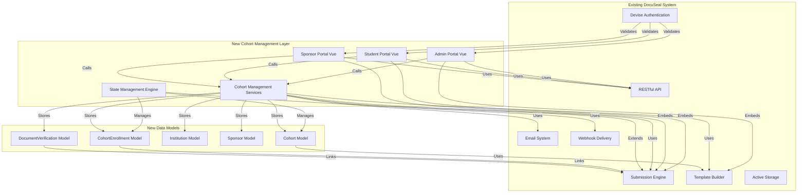

# Component Architecture

## New Components

### **Cohort Management Service Layer**
**Responsibility:** Business logic for cohort lifecycle, state transitions, and workflow orchestration

**Integration Points:**
- Uses existing `Submission` and `Template` services for document workflows
- Integrates with existing `EmailNotification` system for alerts
- Leverages existing `WebhookDelivery` for external integrations

**Key Interfaces:**
- `CohortWorkflowService` - Manages cohort state transitions
- `EnrollmentService` - Handles student enrollment and document submission
- `VerificationService` - Admin document verification workflow
- `SponsorService` - Sponsor signing orchestration

**Dependencies:**
- **Existing Components:** `SubmissionService`, `TemplateService`, `EmailService`, `WebhookService`
- **New Components:** `CohortStateEngine`, `EnrollmentValidator`, `SponsorAccessManager`

**Technology Stack:** Ruby service objects in `lib/cohorts/`, following existing patterns in `lib/submissions/`

### **Admin Portal Vue Application**
**Responsibility:** Cohort creation, management, verification, and analytics interface

**Integration Points:**
- Embeds existing DocuSeal form builder for template creation
- Uses existing API endpoints for document operations
- Integrates with existing authentication system

**Key Interfaces:**
- `CohortDashboard.vue` - Main admin dashboard
- `CohortWizard.vue` - Multi-step cohort creation
- `VerificationInterface.vue` - Document review/rejection
- `SponsorCoordinator.vue` - Sponsor management
- `AnalyticsView.vue` - Reporting and metrics
- `ExcelExport.vue` - FR23 data export

**Dependencies:**
- **Existing Components:** `TemplateBuilder` (embedded), `SubmissionPreview` (embedded)
- **New Components:** `CohortList`, `EnrollmentTable`, `VerificationModal`

**Technology Stack:** Vue 3 Composition API, Custom TailwindCSS, Axios for API calls

### **Student Portal Vue Application**
**Responsibility:** Student enrollment, document upload, and agreement completion interface

**Integration Points:**
- Embeds existing DocuSeal signing form components
- Uses existing file upload infrastructure
- Integrates with existing authentication for student access

**Key Interfaces:**
- `CohortWelcome.vue` - Portal entry and authentication
- `DocumentUpload.vue` - File upload interface
- `AgreementForm.vue` - Embedded DocuSeal form builder
- `StatusDashboard.vue` - Progress tracking
- `ResubmissionFlow.vue` - Rejection handling

**Dependencies:**
- **Existing Components:** `SubmissionForm` (embedded), `FileDropzone` (embedded)
- **New Components:** `CohortAccess`, `DocumentChecklist`, `ProgressTracker`

**Technology Stack:** Vue 3 Composition API, Custom TailwindCSS, Existing submission form components

### **Sponsor Portal Vue Application**
**Responsibility:** Multi-student review, bulk signing, and cohort finalization interface

**Integration Points:**
- Embeds existing DocuSeal signature components
- Uses existing submission APIs for signing workflows
- Integrates with existing authentication for sponsor access

**Key Interfaces:**
- `SponsorDashboard.vue` - Cohort overview and student list
- `StudentReview.vue` - Individual student document review
- `BulkSigning.vue` - Mass signature operations
- `CohortFinalization.vue` - Completion workflow

**Dependencies:**
- **Existing Components:** `SignatureCapture` (embedded), `SubmissionViewer` (embedded)
- **New Components:** `StudentProgressList`, `BulkSignControls`

**Technology Stack:** Vue 3 Composition API, Custom TailwindCSS, Existing signing components

### **State Management Engine**
**Responsibility:** Orchestrate complex workflow states across all three portals

**Integration Points:**
- Hooks into existing submission state machine
- Manages cohort-level state transitions
- Enforces workflow rules (sponsor access only after student completion)

**Key Interfaces:**
- `CohortStateMachine` - State transition logic
- `WorkflowEnforcer` - Business rule validation
- `EventLogger` - Audit trail generation

**Dependencies:**
- **Existing Components:** `SubmissionState` (extended)
- **New Components:** `CohortStateTransitions`, `EnrollmentValidator`

**Technology Stack:** Ruby state machine pattern, ActiveRecord callbacks

## Component Interaction Diagram



## Component Props and Events Documentation

### **Admin Portal Components**

**CohortWizard.vue**
```typescript
// Props
interface Props {
  institutionId: number
  availableTemplates: Template[]  // Existing DocuSeal templates
  programTypes: ['learnership', 'internship', 'candidacy']
}

// Events
interface Emits {
  (e: 'created', cohort: Cohort): void
  (e: 'cancelled'): void
  (e: 'error', message: string): void
}

// State
interface State {
  step: 1 | 2 | 3 | 4
  formData: {
    name: string
    programType: string
    sponsorEmail: string
    studentCount: number
    mainTemplateId: number
    supportingTemplateIds: number[]
    startDate: string
    endDate: string
  }
}
```

**VerificationInterface.vue**
```typescript
// Props
interface Props {
  cohortId: number
  enrollments: Enrollment[]
  verificationHistory: Verification[]
}

// Events
interface Emits {
  (e: 'verified', enrollmentId: number, action: 'approved' | 'rejected', reason?: string): void
  (e: 'bulkVerify', enrollmentIds: number[], action: 'approved' | 'rejected'): void
}
```

### **Student Portal Components**

**DocumentUpload.vue**
```typescript
// Props
interface Props {
  requiredDocuments: string[]  // ['matric', 'id', 'disability', 'qualifications', 'certificates']
  maxFileSize: number  // 10MB
  allowedFormats: string[]  // ['pdf', 'jpg', 'png']
}

// Events
interface Emits {
  (e: 'uploaded', documents: UploadedDocument[]): void
  (e: 'removed', documentId: number): void
  (e: 'error', errors: string[]): void
}

// State
interface State {
  uploadedFiles: File[]
  uploadProgress: Record<number, number>
  validationErrors: string[]
}
```

**AgreementForm.vue**
```typescript
// Props
interface Props {
  templateId: number
  submissionId?: number  // For existing submission
  readOnly?: boolean
}

// Events
interface Emits {
  (e: 'completed', submission: Submission): void
  (e: 'saved', submission: Submission): void
  (e: 'error', error: string): void
}
```

### **Sponsor Portal Components**

**BulkSigning.vue**
```typescript
// Props
interface Props {
  cohortId: number
  studentCount: number
  completedCount: number
  signatureRequired: boolean
  initialsRequired: boolean
}

// Events
interface Emits {
  (e: 'bulkSigned', signatureData: SignatureData): void
  (e: 'individualSign', studentId: number, signatureData: SignatureData): void
  (e: 'error', error: string): void
}

// State
interface State {
  signatureCanvas: HTMLCanvasElement | null
  initialsCanvas: HTMLCanvasElement | null
  selectedStudents: number[]
  isDrawing: boolean
}
```

### **Shared Components**

**PortalNavigation.vue**
```typescript
// Props
interface PortalNavigationProps {
  portal: 'admin' | 'student' | 'sponsor'
  user?: {
    name: string
    email: string
    role?: string
  }
  cohortName?: string
}

// Events
interface PortalNavigationEvents {
  (e: 'navigate', view: string): void
  (e: 'logout'): void
  (e: 'switchRole'): void  // For admin users with multiple roles
}
```

**RoleSwitcher.vue**
```typescript
// Props
interface RoleSwitcherProps {
  availableRoles: Array<{
    role: string
    portal: 'admin' | 'student' | 'sponsor'
    label: string
  }>
  currentRole: string
}

// Events
interface RoleSwitcherEvents {
  (e: 'roleChange', newRole: { role: string, portal: string }): void
}
```

**PortalNotifications.vue**
```typescript
// Props
interface PortalNotificationsProps {
  notifications: Array<{
    id: number
    type: 'success' | 'error' | 'warning' | 'info'
    message: string
    timestamp: string
    read: boolean
  }>
  autoDismiss?: boolean
  dismissTime?: number  // milliseconds
}

// Events
interface PortalNotificationsEvents {
  (e: 'dismiss', notificationId: number): void
  (e: 'markRead', notificationId: number): void
}
```

## UI Mockups and Wireframes Reference

### **Admin Portal Wireframes**

**Dashboard View:**
```
┌─────────────────────────────────────────────────────────────┐
│  FloDoc Cohort Management - Institution Name               │
├─────────────────────────────────────────────────────────────┤
│  [Create Cohort]  [Export Data]  [Settings]  [Logout]      │
├─────────────────────────────────────────────────────────────┤
│  Overview Statistics                                       │
│  ┌─────────────┐ ┌─────────────┐ ┌─────────────┐          │
│  │ Active      │ │ Completed   │ │ Total       │          │
│  │ Cohorts: 5  │ │ Cohorts: 12 │ │ Students: 250│         │
│  └─────────────┘ └─────────────┘ └─────────────┘          │
├─────────────────────────────────────────────────────────────┤
│  Recent Cohorts                                            │
│  ┌──────────────────────────────────────────────────────┐  │
│  │ Q1 2025 Learnership  │ Active │ 32/50 Complete │ [View]│
│  │ Q4 2024 Internship   │ Draft  │ 0/20 Complete  │ [View]│
│  │ Q3 2024 Candidacy    │ Complete │ 45/45 Done   │ [View]│
│  └──────────────────────────────────────────────────────┘  │
└─────────────────────────────────────────────────────────────┘
```

**Cohort Creation Wizard:**
```
Step 1: Basic Information
┌─────────────────────────────────────────────────────────────┐
│ Cohort Name: [Q1 2025 Learnership_______________]          │
│ Program Type: [Learnership ▼]  [Internship] [Candidacy]    │
│ Student Count: [50___]  Sponsor Email: [sponsor@company.com]│
└─────────────────────────────────────────────────────────────┘

Step 2: Templates
┌─────────────────────────────────────────────────────────────┐
│ Main Agreement Template: [Select Template ▼]               │
│ Supporting Templates:                                       │
│ [✓] Code of Conduct  [✓] Privacy Policy  [ ] Other         │
└─────────────────────────────────────────────────────────────┘

Step 3: Timeline
┌─────────────────────────────────────────────────────────────┐
│ Start Date: [2025-02-01]  End Date: [2025-07-31]           │
└─────────────────────────────────────────────────────────────┘

Step 4: Review & Create
┌─────────────────────────────────────────────────────────────┐
│ Summary:                                                    │
│ • 50 students for Learnership program                       │
│ • Main agreement: Learnership Agreement                     │
│ • Supporting docs: Code of Conduct, Privacy Policy          │
│ • Timeline: Feb 1 - Jul 31, 2025                            │
│                                                             │
│ [Create Cohort]  [Back]  [Cancel]                           │
└─────────────────────────────────────────────────────────────┘
```

**Document Verification Interface:**
```
┌─────────────────────────────────────────────────────────────┐
│  Verification Queue - Q1 2025 Learnership                  │
│  [Filter: Pending] [Sort: Date] [Bulk Actions]             │
├─────────────────────────────────────────────────────────────┤
│  Student: John Doe (john@example.com)                      │
│  Documents:                                                │
│  ┌──────────────────────────────────────────────────────┐  │
│  │ Matric Certificate: [Preview] [Approve] [Reject]     │  │
│  │ ID Document:        [Preview] [Approve] [Reject]     │  │
│  │ Disability Doc:     [Preview] [Approve] [Reject]     │  │
│  └──────────────────────────────────────────────────────┘  │
│  Rejection Reason: [____________________________________]   │
│  [Submit Verification]                                     │
└─────────────────────────────────────────────────────────────┘
```

### **Student Portal Wireframes**

**Welcome Screen:**
```
┌─────────────────────────────────────────────────────────────┐
│  Welcome to Q1 2025 Learnership Program                    │
│  Institution: ABC Training Academy                         │
├─────────────────────────────────────────────────────────────┤
│  Your Enrollment Process:                                  │
│  1. Upload Required Documents                              │
│  2. Sign Program Agreement                                 │
│  3. Sign Supporting Documents                              │
│  4. Wait for Admin Verification                            │
│  5. Sponsor Review & Signing                               │
├─────────────────────────────────────────────────────────────┤
│  Required Documents:                                       │
│  • Matric Certificate                                     │
│  • ID Document                                            │
│  • Disability Documentation (if applicable)               │
│  • Tertiary Qualifications                                │
│  • International Certificates (if applicable)             │
│                                                             │
│  [Start Enrollment]                                        │
└─────────────────────────────────────────────────────────────┘
```

**Document Upload:**
```
┌─────────────────────────────────────────────────────────────┐
│  Upload Required Documents                                 │
├─────────────────────────────────────────────────────────────┤
│  Matric Certificate:  [Drag files here or click to browse] │
│                     [Uploaded: matric.pdf ✓]               │
│  ID Document:         [Drag files here or click to browse] │
│                     [Uploaded: id.pdf ✓]                   │
│  Disability Doc:      [Drag files here or click to browse] │
│                     [No file selected]                     │
│  Qualifications:      [Drag files here or click to browse] │
│                     [Uploaded: degree.pdf ✓]               │
│  Certificates:        [Drag files here or click to browse] │
│                     [Uploaded: cert.pdf ✓]                 │
│                                                             │
│  [Continue to Agreement]  [Save Progress]                  │
└─────────────────────────────────────────────────────────────┘
```

**Status Dashboard:**
```
┌─────────────────────────────────────────────────────────────┐
│  Your Enrollment Status: Complete ✓                        │
│  Last Updated: 2025-01-02 14:30                            │
├─────────────────────────────────────────────────────────────┤
│  Progress: ████████████████████░░░░░░░░  75%               │
│                                                             │
│  Documents:                                                │
│  ✓ Matric Certificate - Uploaded & Signed                  │
│  ✓ ID Document - Uploaded & Signed                         │
│  ✓ Disability Doc - Uploaded & Verified                    │
│  ✓ Qualifications - Uploaded & Signed                      │
│  ✓ Certificates - Uploaded & Signed                        │
│                                                             │
│  Next Step: Waiting for Sponsor Review                     │
│  Estimated Time: 2-3 business days                         │
└─────────────────────────────────────────────────────────────┘
```

### **Sponsor Portal Wireframes**

**Cohort Overview:**
```
┌─────────────────────────────────────────────────────────────┐
│  Sponsor Portal - Q1 2025 Learnership                      │
│  Institution: ABC Training Academy                         │
├─────────────────────────────────────────────────────────────┤
│  Cohort Summary:                                           │
│  • Total Students: 50                                      │
│  • Ready for Signing: 50                                   │
│  • Already Signed: 0                                       │
│  • Status: All Complete ✓                                  │
├─────────────────────────────────────────────────────────────┤
│  Student List                                              │
│  ┌──────────────────────────────────────────────────────┐  │
│  │ John Doe     │ john@example.com │ Ready │ [Review]   │  │
│  │ Jane Smith   │ jane@example.com │ Ready │ [Review]   │  │
│  │ ... (48 more)│                   │       │            │  │
│  └──────────────────────────────────────────────────────┘  │
│                                                             │
│  [Bulk Sign All]  [Sign Selected]  [Export Summary]        │
└─────────────────────────────────────────────────────────────┘
```

**Individual Student Review:**
```
┌─────────────────────────────────────────────────────────────┐
│  John Doe - Document Review                                │
│  [← Back to Overview]                                      │
├─────────────────────────────────────────────────────────────┤
│  Student Information:                                      │
│  Age: 23 | Race: Black | City: Johannesburg | Gender: Male │
│  Disability: None                                          │
├─────────────────────────────────────────────────────────────┤
│  Documents for Review:                                     │
│  ┌──────────────────────────────────────────────────────┐  │
│  │ Main Agreement: [View PDF] [Sign]                   │  │
│  │ Code of Conduct: [View PDF] [Sign]                  │  │
│  │ Privacy Policy: [View PDF] [Sign]                   │  │
│  └──────────────────────────────────────────────────────┘  │
│                                                             │
│  Your Signature: [Canvas Area - Draw Here]                │
│  Your Initials:  [Canvas Area - Draw Here]                │
│                                                             │
│  [Sign This Student]  [Skip for Now]                      │
└─────────────────────────────────────────────────────────────┘
```

**Bulk Signing Interface:**
```
┌─────────────────────────────────────────────────────────────┐
│  Bulk Signing - Q1 2025 Learnership                        │
│  50 students ready for signing                             │
├─────────────────────────────────────────────────────────────┤
│  Signature Application:                                    │
│  Apply to: [All 50 Students ▼]  [Selected Students]        │
│                                                             │
│  Your Signature:                                           │
│  ┌──────────────────────────────────────────────────────┐  │
│  │ [Canvas Area - Draw Your Signature]                 │  │
│  │ [Clear]  [Apply to All]                             │  │
│  └──────────────────────────────────────────────────────┘  │
│                                                             │
│  Your Initials:                                            │
│  ┌──────────────────────────────────────────────────────┐  │
│  │ [Canvas Area - Draw Your Initials]                  │  │
│  │ [Clear]  [Apply to All]                             │  │
│  └──────────────────────────────────────────────────────┘  │
│                                                             │
│  [Sign All Documents]  [Cancel]                           │
└─────────────────────────────────────────────────────────────┘
```

---
