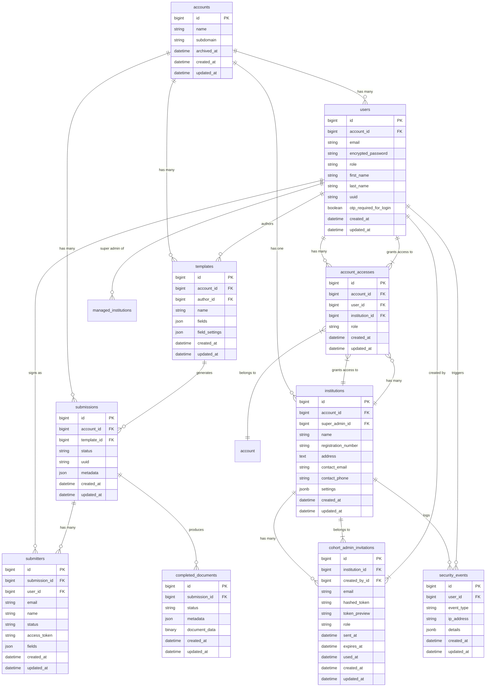
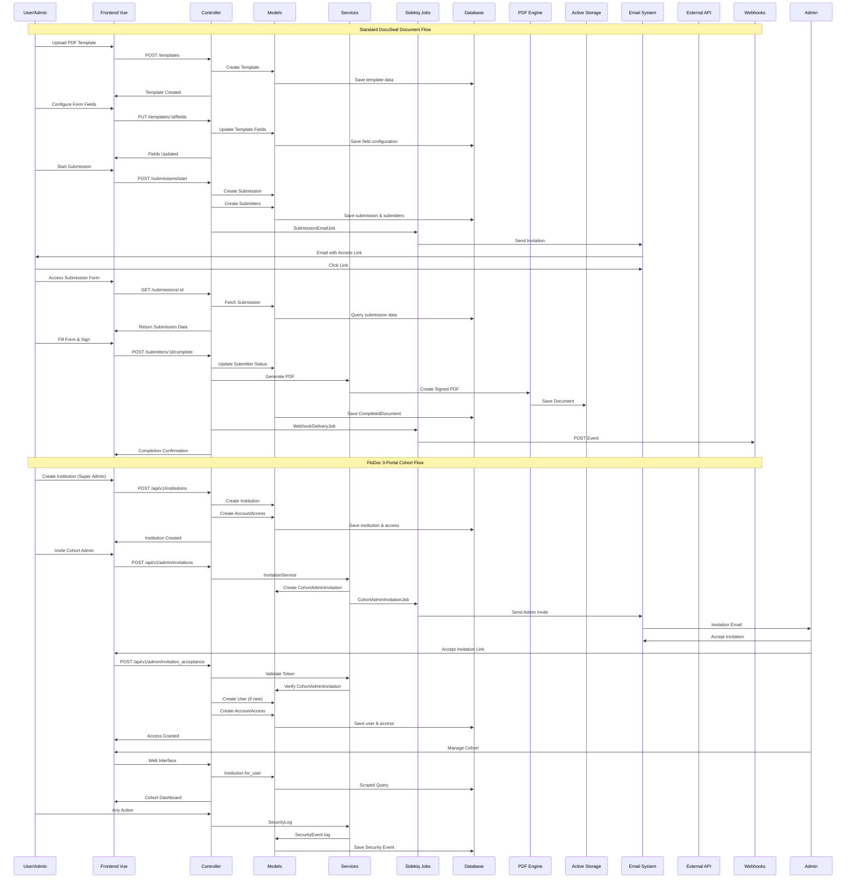
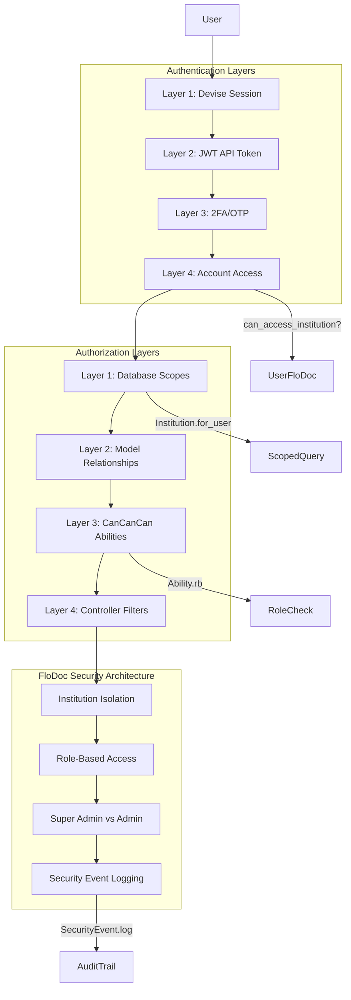

# DocuSeal + FloDoc Current Application Sitemap
## Complete Architecture Analysis

**Generated:** 2025-01-09
**Branch:** feature/brownfield-prd
**Status:** Analysis Complete

---

## 1. High-Level System Architecture

```mermaid
graph TB
    subgraph "External Dependencies"
        DB[(PostgreSQL/MySQL/SQLite)]
        Redis[(Redis)]
        S3[(AWS S3)]
        GCS[(Google Cloud)]
        Azure[(Azure)]
        SMTP[(SMTP Server)]
    end

    subgraph "Load Balancer / Web Server"
        Puma[Puma Web Server]
    end

    subgraph "Rails Application - DocuSeal Core + FloDoc Extensions"
        subgraph "Authentication Layer"
            Devise[Devise Auth]
            JWT[JWT Tokens]
            TwoFA[2FA/OTP]
        end

        subgraph "Routing Layer"
            Routes[config/routes.rb]
            API_V1[API v1 Namespace]
            Web_Routes[Web Interface]
        end

        subgraph "Controllers - DocuSeal Core"
            Auth_C[Authentication]
            Templates_C[Templates]
            Submissions_C[Submissions]
            Submitters_C[Submitters]
            Users_C[Users]
            Accounts_C[Accounts]
            Dashboard_C[Dashboard]
        end

        subgraph "Controllers - FloDoc Additions"
            Institutions_C[Institutions]
            CohortsAdmin_C[Cohorts/Admin]
            AdminInvitations_C[Admin/Invitations]
            SecurityEvents_C[Security Events]
        end

        subgraph "Models - DocuSeal Core"
            User[User]
            Account[Account]
            Template[Template]
            Submission[Submission]
            Submitter[Submitter]
            TemplateDoc[TemplateDocument]
            CompletedDoc[CompletedDocument]
            AccountConfig[AccountConfig]
            Webhook[WebhookEvent]
        end

        subgraph "Models - FloDoc Additions"
            Institution[Institution]
            AccountAccess[AccountAccess<br/>Extended with institution_id]
            CohortAdminInvitation[CohortAdminInvitation]
            SecurityEvent[SecurityEvent]
            UserFloDoc[UserFloDocAdditions<br/>Concern]
        end

        subgraph "Authorization"
            Cancancan[Cancancan Ability]
            Abilities[Ability.rb<br/>Extended for FloDoc]
        end

        subgraph "Business Logic - Services"
            SubmissionsLib[lib/submissions/]
            PDFUtils[lib/pdf_utils.rb]
            PDFium[lib/pdfium.rb]
            InvitationService[InvitationService]
            SecurityLog[Security Logging]
        end

        subgraph "Background Jobs - Sidekiq"
            SubmissionEmail[SubmissionEmailJob]
            Reminder[ReminderJob]
            WebhookDelivery[WebhookDeliveryJob]
            DocumentGen[DocumentGenerationJob]
            CohortInvite[CohortAdminInvitationJob]
        end

        subgraph "Frontend - Vue.js"
            AppJS[application.js]
            TemplateBuilder[Template Builder]
            SubmissionForm[Submission Form]
            Elements[Custom Elements]
        end

        subgraph "Email System"
            Mailers[Action Mailers]
            CohortMailer[CohortMailer]
            TemplatesMailer[Templates Mailers]
        end
    end

    %% External Connections
    Puma --> DB
    Puma --> Redis
    Puma --> S3
    Puma --> GCS
    Puma --> Azure
    BackgroundJobs -.-> SMTP

    %% Request Flow
    User[Browser/Mobile] --> Puma

    %% Authentication Flow
    Puma --> Devise
    Devise --> JWT
    Devise --> TwoFA

    %% Routing
    Puma --> Routes
    Routes --> API_V1
    Routes --> Web_Routes

    %% Core Controllers
    API_V1 --> Auth_C
    API_V1 --> Templates_C
    API_V1 --> Submissions_C
    API_V1 --> Submitters_C
    API_V1 --> Users_C
    API_V1 --> Accounts_C

    Web_Routes --> Dashboard_C

    %% FloDoc Controllers
    API_V1 --> Institutions_C
    API_V1 --> AdminInvitations_C
    API_V1 --> SecurityEvents_C
    Web_Routes --> CohortsAdmin_C

    %% Controllers to Models
    Auth_C --> User
    Templates_C --> Template
    Submissions_C --> Submission
    Submitters_C --> Submitter
    Users_C --> User
    Accounts_C --> Account

    Institutions_C --> Institution
    Institutions_C --> AccountAccess
    CohortsAdmin_C --> Institution
    AdminInvitations_C --> CohortAdminInvitation
    SecurityEvents_C --> SecurityEvent

    %% FloDoc Model Relationships
    User --> UserFloDoc
    UserFloDoc --> AccountAccess
    AccountAccess --> Institution

    Institution --> CohortAdminInvitation
    Institution --> SecurityEvent

    %% Authorization
    Controllers --> Cancancan
    Cancancan --> Abilities
    Abilities --> User
    Abilities --> Institution
    Abilities --> AccountAccess

    %% Services
    Submissions_C --> SubmissionsLib
    Submissions_C --> PDFUtils
    Submissions_C --> PDFium
    AdminInvitations_C --> InvitationService
    SecurityEvents_C --> SecurityLog

    %% Background Jobs
    Submissions_C --> SubmissionEmail
    Submissions_C --> Reminder
    Submissions_C --> WebhookDelivery
    Submissions_C --> DocumentGen
    AdminInvitations_C --> CohortInvite

    %% Frontend
    AppJS --> TemplateBuilder
    AppJS --> SubmissionForm
    AppJS --> Elements

    %% Email
    Mailers --> SMTP
    CohortInvite --> CohortMailer
    SubmissionEmail --> TemplatesMailer
```



---

## 2. Database Schema - Core Tables



---

## 3. API Endpoint Structure

```mermaid
graph TB
    subgraph "API v1 Base: /api/v1"
        Auth[Authentication]

        subgraph "Core DocuSeal Endpoints"
            Templates[/templates]
            Submissions[/submissions]
            Submitters[/submitters]
            Users[/users]
            Accounts[/accounts]
            Webhooks[/webhooks]
        end

        subgraph "FloDoc Institution Endpoints"
            Institutions[/institutions]
            Admin[/admin/invitations]
            Security[/security-events]
        end

        subgraph "Template Endpoints"
            T_Documents[/templates/:id/documents]
            T_Sharing[/templates/:id/sharing]
            T_Fields[/templates/:id/fields]
            T_Preview[/templates/:id/preview]
        end

        subgraph "Submission Endpoints"
            S_Start[/submissions/start]
            S_Complete[/submissions/:id/complete]
            S_Download[/submissions/:id/download]
            S_Events[/submissions/:id/events]
        end

        subgraph "Submitter Endpoints"
            Sub_Complete[/submitters/:id/complete]
            Sub_Sign[/submitters/:id/sign]
            Sub_Download[/submitters/:id/download]
            Sub_Email[/submitters/:id/send-email]
        end
    end

    %% Authentication
    Auth --> |JWT Token| Templates
    Auth --> |JWT Token| Submissions
    Auth --> |JWT Token| Institutions

    %% Core Flow
    Templates --> T_Documents
    Templates --> T_Sharing
    Templates --> T_Fields
    Templates --> T_Preview

    Submissions --> S_Start
    Submissions --> S_Complete
    Submissions --> S_Download
    Submissions --> S_Events

    Submitters --> Sub_Complete
    Submitters --> Sub_Sign
    Submitters --> Sub_Download
    Submitters --> Sub_Email

    %% FloDoc Flow
    Institutions --> Admin
    Institutions --> Security

    %% Webhooks
    Webhooks --> |POST Events| External[External Systems]
```

---

## 4. Data Flow - Document Signing Workflow



---

## 5. Authentication & Authorization Flow



---

## 6. FloDoc-Specific Additions Summary

### Models Added
- **Institution** - Multi-tenant organization container
- **AccountAccess** - Extended with `institution_id` and new roles
- **CohortAdminInvitation** - Secure admin invitation system
- **SecurityEvent** - Audit trail for security actions
- **UserFloDocAdditions** - Concern for User model

### Controllers Added
- **Cohorts::AdminController** - Web interface for cohort management
- **Api::V1::InstitutionsController** - REST API for institutions
- **Api::V1::Admin::InvitationsController** - Admin invitation management
- **Api::V1::Admin::InvitationAcceptanceController** - Accept invitations
- **Api::V1::Admin::SecurityEventsController** - Security monitoring

### Database Migrations
- `20250103000001_add_institution_id_to_account_access.rb`
- `20250103000002_create_institutions.rb`
- `20250103000003_create_cohort_admin_invitations.rb`
- `20250103000005_backfill_institution_data.rb`
- `20250103000006_create_security_events.rb`

### Services & Jobs
- **InvitationService** - Handles admin invitation creation and validation
- **CohortAdminInvitationJob** - Async email delivery
- **SecurityAlertJob** - Alert threshold monitoring

### Routes Added
```ruby
# API v1
namespace :admin do
  resources :invitations
  resources :invitation_acceptance
  resources :security_events
end
resources :institutions

# Web Interface
resources :cohorts, only: [] do
  resources :admin, controller: 'cohorts/admin'
end
```

---

## 7. Current State Assessment

### ✅ Implemented (FloDoc Additions)
1. **Institution Management** - CRUD operations with security
2. **Admin Invitation System** - Token-based secure invitations
3. **Role-Based Access** - cohort_super_admin and cohort_admin roles
4. **Security Event Logging** - Audit trail for all actions
5. **4-Layer Security Architecture** - Database → Model → Controller → UI
6. **Data Isolation** - Institution-scoped queries via `Institution.for_user`

### ⚠️ Partially Implemented
1. **Cohort Model** - Referenced in Ability.rb but not created
2. **Sponsor Model** - Referenced in Ability.rb but not created
3. **Student Portal** - Not started
4. **Sponsor Portal** - Not started
5. **Excel Export** - Mentioned in PRD but not implemented

### ❌ Not Started
1. **CohortEnrollment Model** - Student enrollment tracking
2. **Document Verification Workflow** - Manual verification process
3. **3-Portal UI** - Custom Vue portals for Admin/Student/Sponsor
4. **Cohort Dashboard** - Analytics and status tracking
5. **Multi-signer Cohort Workflows** - Integration with DocuSeal submissions
6. **Excel Export (FR23)** - Cohort data export functionality

---

## 8. Key Integration Points

### Where FloDoc Hooks Into DocuSeal
1. **User Model** - `include UserFloDocAdditions` adds institution relationships
2. **AccountAccess** - Extended with `institution_id` and new role types
3. **Ability.rb** - Added FloDoc permissions alongside existing DocuSeal rules
4. **Routes** - New namespaces under existing API structure
5. **Database** - New tables with foreign keys to existing tables

### What Remains Unchanged
1. **Core Models** - Template, Submission, Submitter, CompletedDocument
2. **PDF Processing** - HexaPDF and PDFium usage
3. **Authentication** - Devise + JWT (unchanged)
4. **Background Jobs** - Existing Sidekiq infrastructure
5. **Storage** - Active Storage configuration
6. **API Patterns** - RESTful conventions maintained

---

## 9. Next Steps for Complete Implementation

Based on the PRD and Architecture docs, the remaining work involves:

1. **Create Missing Models**: Cohort, CohortEnrollment, Sponsor
2. **Build 3-Portal UI**: Custom Vue portals with TailwindCSS (no DaisyUI)
3. **Integrate Document Workflows**: Connect cohort management to DocuSeal submissions
4. **Implement Excel Export**: Using rubyXL gem
5. **Add Verification Workflow**: Manual document verification with audit trail
6. **Cohort Dashboard**: Analytics and status tracking
7. **Student Portal**: Enrollment and document submission interface
8. **Sponsor Portal**: Review and signing interface
9. **Complete Testing**: RSpec tests for all new functionality
10. **Documentation**: API docs for new endpoints

---

**Analysis Complete** - This sitemap provides a comprehensive view of the current DocuSeal + FloDoc application state, clearly distinguishing between vanilla DocuSeal features and FloDoc additions.